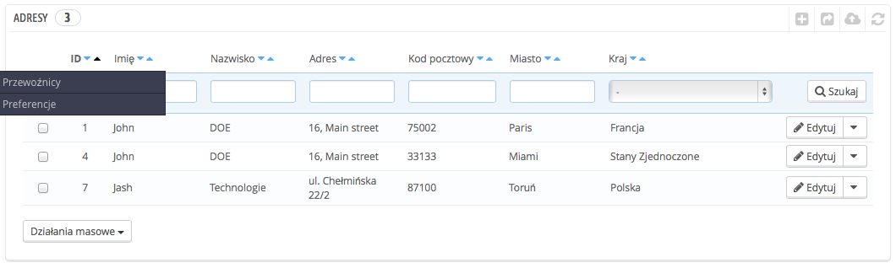
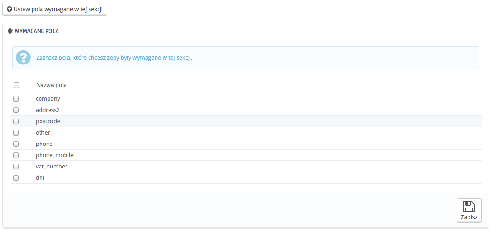
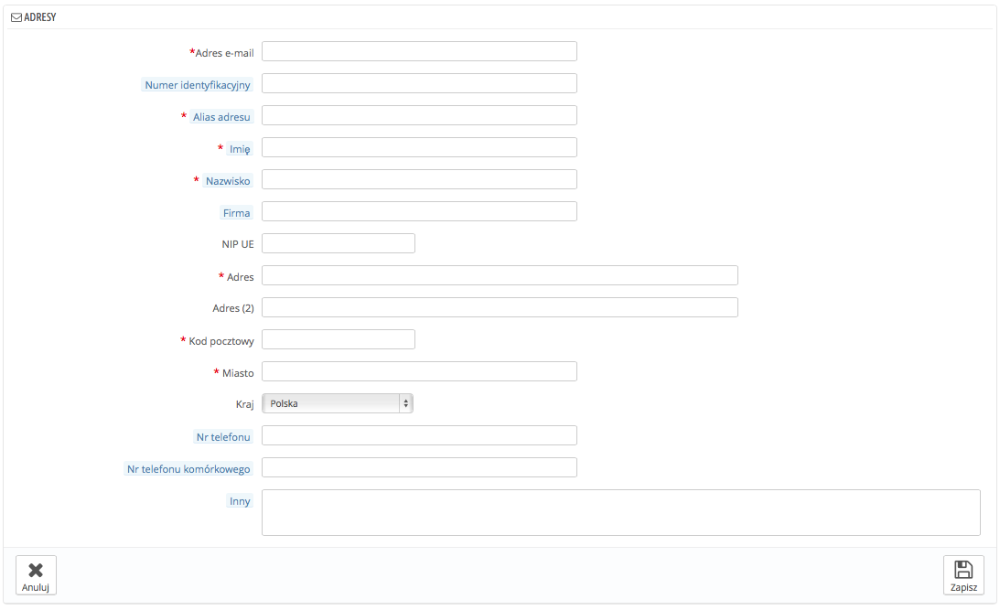

# Adresy klientów

Klikając na stronę “Adresy”, otrzymasz dostęp do listy adresów Twoich klientów (adres zamieszkania, miejsca pracy itp.). Informacje te możesz edytować, klikając na przycisk “edytuj”, lub usunąć.

Poniżej listy adresowej znajduje się przycisk o nazwie "Ustaw pola wymagane w tej sekcji". Po kliknięciu na niego otworzy się formularz, w którym to będzie można wskazać, które z informacji mają być niezbędne (poprzez zaznaczenie ich). Możesz więc sprawić, że pola takie jak np. firma i numer telefonu będą polami obowiązkowymi podczas tworzenia nowego adresu przez klienta.

## Dodawanie nowego adresu 

Masz możliwość dodania adresu do klienta poprzez przycisk "Doda nowy adres". Po jego kliknięciu otworzy się formularz z polami do wypełnienia (dane osobowe, adres zamieszkania, itp.)

Zwróć szczególną uwagę na następujące pola:

* **E-mail klienta**. To pole jest obowiązkowe. Jeśli dodasz adres do już istniejącego użytkownika, MUSISZ rozpoznać go za pomocą adresu e-mail. W innym przypadku PrestaShop nie będzie wiedział, do kogo przypisać ten adres.
* **Numer Identyfikacji Podatkowej (VAT UE)**. Numer dowodu osobistego lub numer identyfikacji podatkowej klienta. To pole ma charakter fakultatywny.
* **Alias adresu**. Krótki opis pozwalający klientowi na wybranie odpowiedniego adresu "Dom", "Praca", "Ciocia Grażyna", itp.
* **Inny**. Dodatkowe informacje pomocne przy nadawaniu przesyłki.
