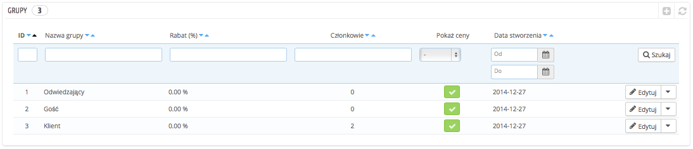
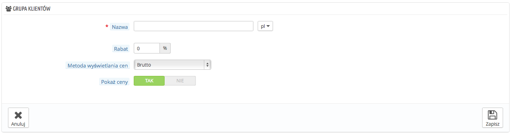
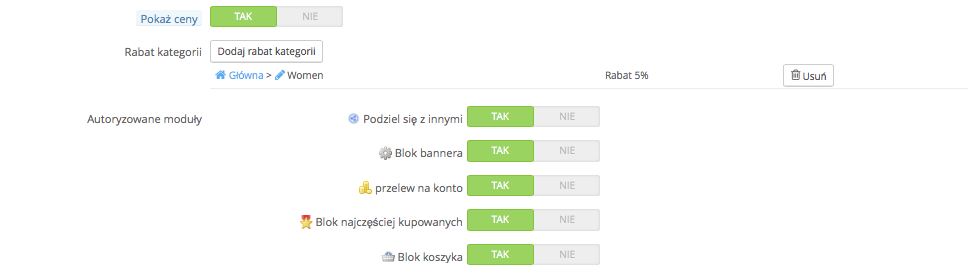

# Grupy klientów

PrestaShop daje możliwość nadania przywilejów Twoim klientom, zapisując ich do poszczególnych grup. Zarówno liczba grup klientów, jak i miejsc w nich jest nieograniczona.

Wszystko ustala się na stronie “Grupy” w menu “Klienci”.

Domyślnie dostępne są trzy grupy:

* **Visitor (Odwiedzający)**. Osoby nieposiadające konta klienta lub osoby nieuwierzytelnione.
* **Guest (Goście)**. Wszystkie osoby, które złożyły zamówienie za pośrednictwem guest checkout - należy pamiętać o tym, aby ta opcja była aktywowana.
* **Customer (Klienci)**. Wszystkie osoby, które założyły konto w sklepie i zostało ono uwierzytelnione.

Te trzy grupy nie mogą zastać usunięte.

Aby stworzyć inne grupy, kliknij na “Dodaj nową grupę”. Otworzy się następujący formularz:

* **Nazwa**. Użyj krótkiej i charakterystycznej nazwy.
* **Rabat procentowy.** Rabat, którego chcesz udzielić na wszystkie produkty w sklepie, dla członków tej grupy. Być może wolisz nie udzielać rabatu tutaj, tylko przejść poprzez reguły koszyka. Aby dowiedzieć się więcej o zasadach koszyka, przeczytaj kolejny rozdział tego przewodnika "Tworzenie reguł cenowych oraz rabatów".
* **Sposób wyświetlania cen.** PrestaShop jest często wykorzystywany w sektorze B2B (Business to Business). Możesz stworzyć grupę klientów, którzy mogą kupować bez podatku VAT. Rozwijana lista pozwala Ci wybrać, czy wyświetlane ceny będą brutto czy netto.
* **Pokaż ceny.** Domyślnie wszyscy użytkownicy sklepu mogą zobaczyć ceny. Aby zmienić te ustawienia, przejdź na stronę “Klienci” -> “Grupy” i przy wybranej z grup, w kolumnie “Pokaż ceny” zmień zielony znacznik na czerwony krzyżyk.

Po wprowadzeniu wszelkich niezbędnych danych możesz zapisać grupę. Jeśli chcesz dostosować ją za pomocą modułu lub kategorii, kliknij na końcu wiersza przycisk “Edytuj”. Wyświetli się formularz z dodatkowymi opcjami:

* **Rabat kategorii**. Kliknij na przycisk “Dodaj rabat kategorii”, aby otworzyć nowe okno z listą wszystkich kategorii. Możesz z niej wybrać jedną kategorię i udzielić określonego rabatu, który będzie przypisany tylko dla niej.Zauważ, że:\

  * Tylko ceny produktów, które mają tę kategorię jako kategorię domyślną, będą mogły zostać objęte rabatem.
  * Rabat zastosowany do kategorii nie łączy się z całkowitą obniżką, ale ją zastępuje.
  * Możesz dodać do grupy klientów tyle kategorii, ile potrzeba - pozwoli Ci to, w zależności od Twojego uznania, na udzielanie tej grupie całego szeregu różnych zniżek.
* **Autoryzowane moduły.** Ta sekcja pozwoli Ci na zablokowanie dostępu do niektórych modułów dla członów grupy. Możesz na przykład sprawić, że niektórzy klienci nie będą mogli zobaczyć bestsellerów lub aktualnych promocji.

Możesz dodać klienta do wybranej przez Ciebie grupy, edytując jego informacje: z poziomu listy klientów (Menu “Klienci” -> strona “Klienci”). Kliknij na ikonę “Edytuj” znajdującą się na końcu wiersza w tabeli z listą klientów. Następnie wybierz grupę, do której chciałbyś, aby Twój klient należał. W przypadku, gdy przypiszesz mu więcej grup, pamiętaj o wskazaniu jego grupy głównej w polu “Domyślna grupa klientów”.

