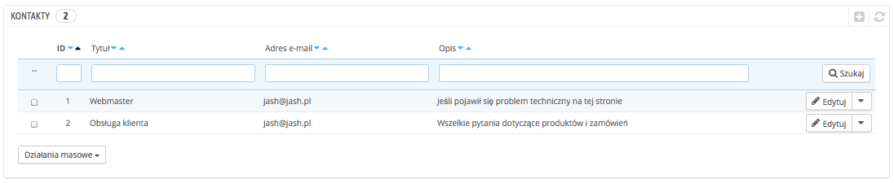

# Kontakty

Dla ułatwienia kontaktu z klientami możesz stworzyć wiele działów kontaktowych, np. serwis obsługi klienta, serwis techniczny, serwis sprzedaży itp. Ta funkcjonalność pozwala użytkownikom w zależności od ich potrzeb na bezpośredni kontakt z właściwą osobą.

## Tworzenie nowych działów do kontaktu 

Aby wiadomości zostały poprawnie wysłane do właściwych odbiorców, musisz skonfigurować kontakty w swoim e-sklepie.

Strona “Kontakty” w menu “Klienci” przedstawia listę istniejących kontaktów.

Kliknij na “Dodaj”, aby przejść do formularza kontaktowego:

* **Tytuł**. Nazwa kontaktu: albo nazwisko osoby, albo nazwa serwisu. Możesz również zdecydować się na użycie frazy, np. takiej jak “Mam problem z moim zamówieniem”, “Chcę zwrócić produkt”, “Chcę zostać partnerem”.
* **Adres e-mail**. Adres ten może być taki sam (podobnie jak inne dane kontaktowe). W sytuacji, gdy nie masz pracowników, każdy kontakt może zostać przypisany do tego samego adresu e-mail. Klienci nie dowiedzą się o tym, jednakże posiadanie wielu kontaktów może pomóc Ci w budowaniu zaufania do Twojego e-sklepu.
* **Zapisywanie wiadomości?** Wybierz, czy wiadomości powinny zostać zapisywane w narzędziu zarządzania obsługą klienta, czy też powinny być wysyłane za pośrednictwem e-mail. Jeśli ta opcja jest wyłączona, PrestaShop nie pomoże Ci w zarządzaniu wiadomościami dla tego kontaktu. Może się to okazać przydatne dla takiego kontaktu, jak “Chcę zostać partnerem”, ponieważ być może będziesz wolał, aby te wiadomości przychodziły bezpośrednio na Twoją skrzynkę pocztową (bez możliwości przeczytania przez pracowników).
* **Opis**. Krótki, zajmujący nie więcej niż jedną linię, tak jak jest on wyświetlany klientowi w formularzu kontaktowym.

## W jaki sposób klienci mogą się z Tobą skontaktować 

Aby skontaktować się z właściwą ekipą pracowników, klient musi kliknąć na link “Kontakt z nami” znajdujący się u góry albo u dołu strony.  Po kliknięciu otworzy się formularz kontaktowy.

Klient ma możliwość wyboru serwisu, z którym chce się skontaktować. Aby wysłać poprawnie wiadomość, należy wprowadzić adres e-mail i treść wiadomości. Rozwijane menu pozwoli mu na wskazanie zamówienia, a także produktu, którego jego wiadomość dotyczy.
