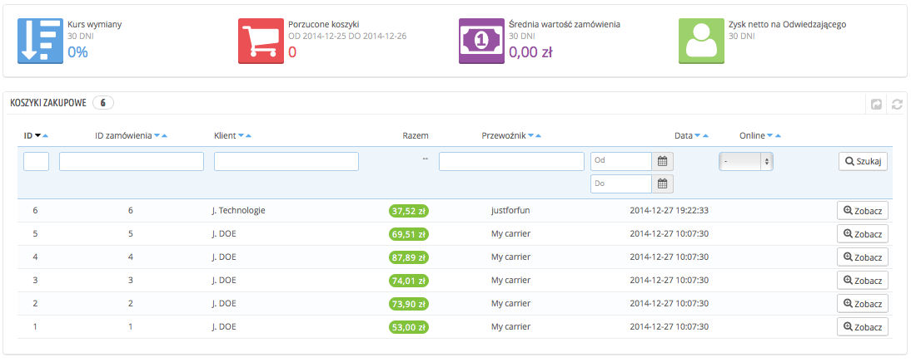
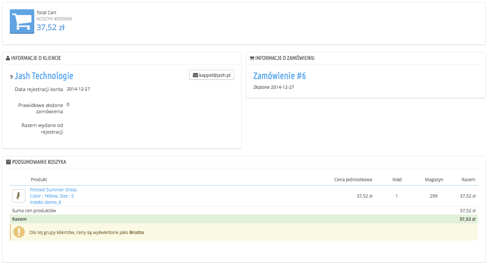

# Koszyki zakupowe

PrestaShop zawiera kilka bardzo użytecznych funkcji marketingowych, które pozwalają na wyświetlenie produktów aktualnie dodawanych przez klientów do ich koszyków. Istnieją na to dwa sposoby:

1. Przejdź do strony “Klienci” w menu “Klienci” i znajdź klienta, którego poszukiwałeś. Następnie wyświetl jego profil i zjedź w dół aż do sekcji “Koszyki”, w której będziesz mógł zobaczyć koszyki stworzone przez klienta.
2. Przejdź do strony “Koszyki zakupowe” w menu “Klienci”. Koszyki są posortowane według ID. Znajdź wybranego klienta.

W obu przypadkach możesz kliknąć na ikonę “Zobacz”, aby zobaczyć zawartość koszyka Twojego klienta i wykorzystać tę informację celem poprawienia wyników handlowych.

Na stronie koszyka najbardziej istotna informacja znajduje się w sekcji “Podsumowanie koszyka”. Dzięki niej możecie zobaczyć, które produkty kupił klient, ich cenę jednostkową oraz ilość, jak również łączną wartość koszyka.

Zarządzanie porzuconymi koszykami

Porzucenie koszyka często oznacza zaniechanie zakupu. Strona “Koszyki zakupowe” wyświetla koszyki, które zostały zatwierdzone do realnej sprzedaży. Teraz do Ciebie należy przypomnienie klientom, że mogą wrócić i dokończyć swoje zakupy.

Porzucone koszyki (lub “koszyki duchy”) posiadają link, mający na celu ich usunięcie. Znajduje się on na końcu każdego wiersza. Natomiast koszyki bez możliwości usunięcia to te, które są w trakcie przetwarzania zamówienia, co oznacza, że zakup został potwierdzony i należy dostarczyć produkty.

Domyślnie to Ty powinieneś skontaktować się z klientem opuszczonego koszyka. Możesz również zainstalować moduł Customer Follow-up, który jest dostępny podczas domyślnej instalacji. Moduł ten pozwala na wysłanie bonów rabatowych do tych klientów, którzy porzucili koszyki lub tych, którym chciałbyś podziękować za ich zamówienie. Istnieje również opcja wysyłania bonów rabatowych do najlepszych klientów, aby podziękować im za ich wierność. Zwróć uwagę, że może to doprowadzić do pewnego rodzaju nadużycia. Mianowicie niektórzy z  klientów mogą specjalnie porzucać swoje koszyki tylko po to, aby otrzymać bon zniżkowy.

Jeśli chcesz posiadać kompletne narzędzie, możesz kupić moduł PrestaShop przypominający klientom o porzuceniu koszyka: [http://addons.prestashop.com/en/checkout-modules/16535-abandoned-cart-pro.html](http://addons.prestashop.com/en/checkout-modules/16535-abandoned-cart-pro.html).
