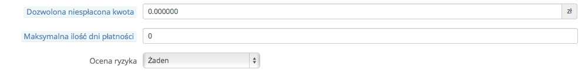
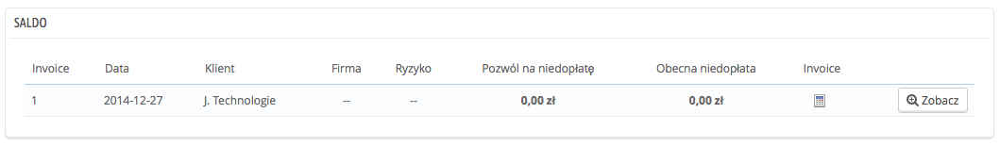

# Saldo

Ta strona jest dostępna dopiero po aktywacji funkcji B2B. Aby to zrobić, przejdź na stronę preferencji klientów i wybierz “Tak” dla opcji “Aktywuj tryb B2B”

Ta strona wyświetla listę środków pieniężnych przyznanych niektórym klientom. To Ty ustalasz jej wysokość i przydział. Klienci mogą je przeznaczyć na zakup produktów, zanim dokonają płatności.

## Włączenie tej funkcji 

Gdy tryb B2B został już aktywowany (strona Preferencji -> Klienci), pojawiają się trzy pola w formularzu służącym do tworzenia kont klientów:

* **Zatwierdzone środki pieniężne**. Maksymalna suma pieniędzy, którą klient może wykorzystać.
* **Maksymalny termin płatności**. Maksymalna liczba dni, którą klient dysponuje przed ostatecznym terminem zapłaty udzielonymi mu środkami pieniężnymi.
* **Ocena ryzyka**. Czynnik ryzyka dla konkretnego klienta: żaden, niski, średni, wysoki. Do Ciebie należy decyzja, czy możesz przydzielić klientowi środki pieniężne i ocena, czy zapłaci na czas.

Należy wypełnić te pola dla wszystkich klientów biznesowych.

## Bieżący widok środków pieniężnych 

Każdy zakup dokonany przez klienta korzystającego ze środków pieniężnych przyznanych przez Ciebie zostaje odnotowany na stronie Klienci -> Zatwierdzone środki pieniężne. Pozwoli Ci to na bieżący przegląd zaległych faktur.

