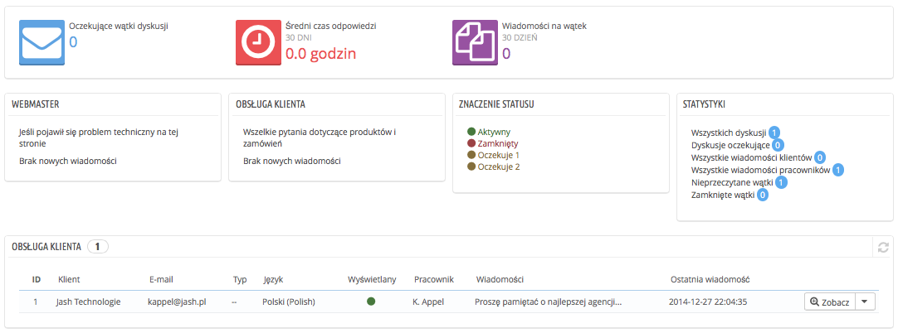
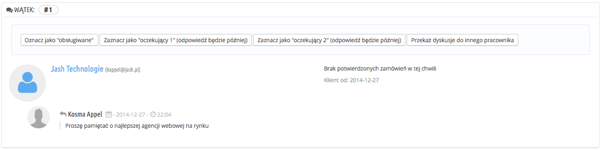
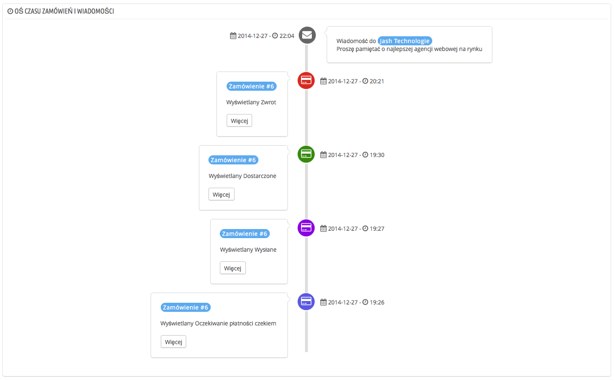
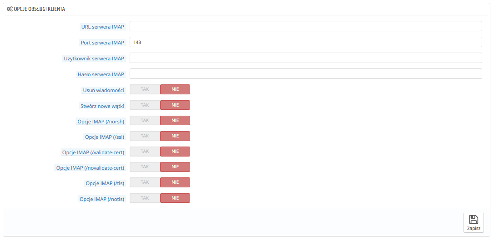

# Serwis obsługi klienta

PrestaShop pozwala Ci na centralizację wszystkich zapytań Twoich klientów. To narzędzie ma za zadanie pomóc Ci w łatwy sposób rozpoznać, które z zapytań pozostały jeszcze bez odpowiedzi zamiast sprawdzać to z osobna dla każdego z odbiorców.

W praktyce formularz kontaktowy Twojego sklepu, dostępny poprzez link “Kontakt” umieszczony na dole front-office, domyślnie wyświetla dane do “Serwisu klienta” oraz “Webmastera”. Klient może wybrać tylko osobę lub serwis, z którym chce się skontaktować, a następnie wypełnić informacje w pozostałych polach. Zatem wiadomość zostaje zapisana w narzędziu obsługi klienta PrestaShop.

Wątki dyskusyjne znajdują się tylko w narzędziu zarządzania klientem, pod warunkiem że w użytym kontakcie została aktywowana opcja “Zapisać wiadomość?”. Ta opcja może zostać aktywowana po przejściu na stronę “Kontakty” w menu “Klienci”. Strona ta jest szczegółowo omówiona w kolejnej sekcji tego rozdziału.

Jeśli opcja zapisywania wiadomości jest dezaktywowana dla kontaktu wybranego przez klienta, wiadomość zostanie wysłana tylko na adres e-mail wprowadzony do kontaktu i nie będzie przechowywana w PrestaShop.

Należy również poprawnie skonfigurować opcję IMAP, żeby PrestaShop mógł zbierać odpowiedzi klientów na maile, które zostały im wysłane poprzez narzędzie obsługi klienta. Odbywa się to w sekcji "Opcje obsługi klienta" na stronie “Obsługa klienta” w menu “Klienci", znajdującej się na dole strony.

Na stronie “Obsługa klienta” każdy kontakt posiada swoją własną sekcję, z której możesz szybko odczytać informacje dotyczące nowych wiadomości (w tym wiadomości nieprzeczytanych). Domyślnie są wprowadzone dwa kontakty, jednakże jeśli dodasz ich więcej, to sekcje “Znaczenie statusu” i “Statystyki” zostaną przesunięte w lewą stronę, do dołu.

Te dwie ostatnie sekcje są bardzo praktyczne z punktu widzenia codziennego zarządzania nowymi wiadomościami:

* **Znaczenie statusu**. Proste przypomnienie kodów kolorystycznych, które zespół może zastosować do wątków dyskusji.
* **Serwis klienta: Statystyki**. Globalny podgląd działalności działu obsługi klienta od samego początku.

Nieco poniżej znajdziesz listę wiadomości zarówno tych starych, jak i nowych.

U dołu strony masz dostęp do dwóch opcji, które mają zastosowanie do wszystkich kontaktów:

* **Autoryzacja przesyłania plików**. Tu ustalisz, czy klient może dołączyć plik do wiadomości. Może to okazać się bardzo przydatne w przypadku wystąpienia problemów graficznych w Twoim sklepie, ponieważ wtedy klient będzie w stanie dołączyć zrzut ekranu.
* **Predefiniowana wiadomość**. Domyślny szablon odpowiedzi Twoich pracowników. Stwórz prostą wiadomość, tak aby mogła ona znaleźć zastosowanie w jak największej liczbie przypadków z jak najmniejszą liczbą zmian.

Na dole strony znajduje się sekcja “Opcje obsługi klienta”, w której możesz zamieścić wszelkie zasady dotyczące Twojego serwera wiadomości (IMAP).

## Obsługa wiadomości wymienianych z klientami 

Każda rozmowa z klientem może być całkowicie zarządzana poprzez kompletny interface PrestaShop, bez konieczności korzystania z poczty e-mail klienta, takiej jak Outlook czy Thunderbird.

Na liście rozmów kliknij na jeden z wierszy, aby zobaczyć szczegóły rozmowy:

* Masz do dyspozycji garść działań, które możesz zastosować przy dyskusjach, aby ułatwić sobie ich sortowanie i tym samym usprawnić ich obsługę. Istnieją na to cztery sposoby:
  * **Oznaczenie jej jako “przetworzona”** lub **“ponownie otwarta”**. Zmienić status dyskusji z “Zamkniętego” na “Otwarty”.
  * **Oznaczenie jej jako “oczekująca 1”** i **“oczekująca 2”**. Są to dwa wewnętrzne statusy. Ich znaczenie zależy od Twoich pracowników. Możesz także nie używać tego sposobu oznaczania i pozostać przy podziale na dyskusje otwarte i dyskusje zamknięte.
  * **Przekazanie dyskusji do innego pracownika**. Pracownik staje się odpowiedzialny za zapytanie już w momencie odpowiedzi na nie. Jeśli w trakcie trwania rozmowy okaże się, że klientem powinna zająć się inna osoba, możesz użyć tego przycisku, aby przypisać osobę z rozwijanej listy. Nowo przypisany pracownik otrzyma powiadomienie. Jeśli osoba, której chcesz przekazać tę rozmowę nie znajduje się na liście, wybierz z niej opcję "Inna osoba". Po dokonaniu wyboru wyświetlą się Tobie dwie opcje, które pozwalają na wskazanie adresu e-mail odbiorcy i na dodanie komentarza dotyczącego dyskusji.
* **Odpowiedź na kolejną wiadomość z tej konwersacji, na którą jeszcze jej nie udzielono**.

Dostępne są następujące szczegóły:

* Nazwisko klienta i adres e-mail, na które możesz kliknąć, aby uzyskać informacje dotyczące klienta.
* Liczba zamówień, suma wydanych pieniędzy oraz data rejestracji klienta.
* Godzina i data wysłania wiadomości.
* Treść wiadomości.

Aby odpowiedzieć na tę wiadomość, użyj formularza z domyślną wiadomością (o jej konfiguracji przeczytasz w sekcji “Opcje Kontaktu” w rozdziale “Obsługa klienta”) i kliknij “Wyślij”.

Na dole strony sekcja “Historia zamówień i wiadomości” przedstawia jasny, chronologiczny widok wydarzeń odnoszących się do tego wątku dyskusji.

## Opcje obsługi klienta 

Ta sekcja pozwala na dokładną konfigurację dostępów PrestaShop z Twoim serwerem e-mail poprzez interface IMPA. Będzie trzeba upewnić się, czy wszystkie pola są poprawnie wypełnione, tak aby narzędzie zarządzania obsługą klienta mogło poprawnie funkcjonować. Większość z tych informacji musi zostać dostarczona przez Twojego dostawcę usług hostingowych.

* **Adres URL** **IMAP**, port **IMAP**, użytkownik **IMAP** oraz hasło **IMAP**. Podstawowe dane dostępu do serwera poczty e-mail przy użyciu protokołu IMAP.
* **Usuwanie wiadomości**. Jeśli ta opcja jest aktywowana, wiadomości zostaną usunięte z serwera natychmiast po zebraniu ich przez PrestaShop. Zachowaj ostrożność: ta opcja sprawi, że Twoje wiadomości staną się niedostępne dla innych klientów poczty e-mail.
* **/norsh**. Jeśli ta opcja jest włączona, połączenie z serwerem poczty e-mail nie będzie wstępnie autoryzowane. Nie jest zalecana.
* **/ssl**. Jeśli ta opcja jest włączona, połączenie z serwerem poczty e-mail nie zostanie zaszyfrowane. Nie jest zalecana.
* **/validate-cert**. Jeśli ta opcja jest włączona, PrestaShop wymusi walidację certyfikatu TLS / SSL serwera.
* **/novalidate-cert**. Jeśli ta opcja jest włączona, PrestaShop nigdy nie będzie próbował zweryfikować certyfikatu TLS / SSL serwera. Niezbędne dla serwerów z self-signed certificate..
* **/tls**. Jeśli ta opcja jest włączona, PrestaShop wymusi stosowanie StartTLS do szyfrowania połączenia. A zatem serwery, które nie obsługują StartTLS zostaną odrzucone.
* **/notls**. Jeśli ta opcja jest włączona, PrestaShop nie będzie używać StartTLS do szyfrowania sesji, nawet przy serwerach, które go obsługują.
