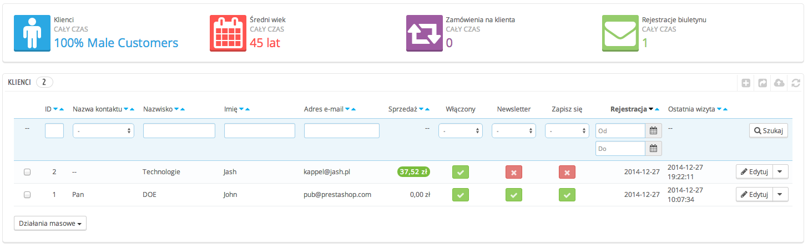
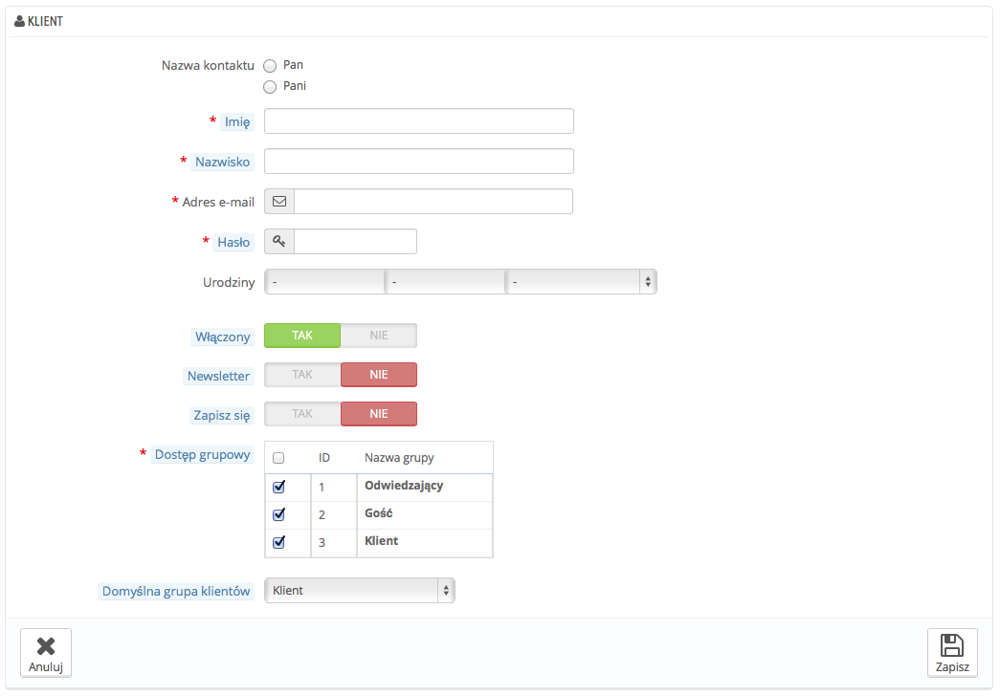
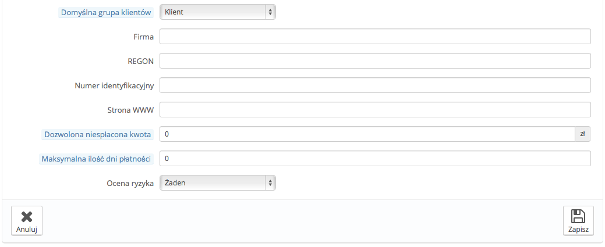
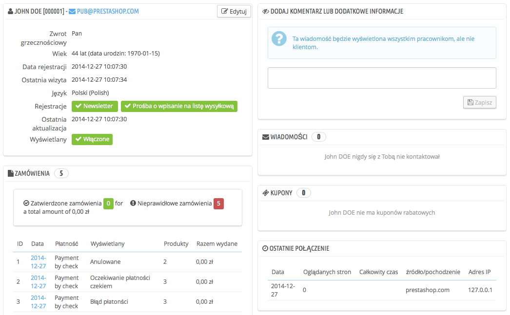
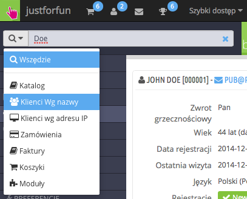
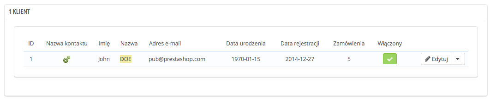
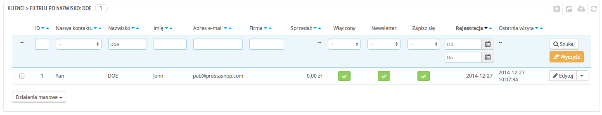

# Twoi klienci

Pierwsza strona menu “Klienci” przedstawia listę wszystkich zapisanych użytkowników sklepu.



Lista ta pozwala na globalny podgląd wszystkich klientów, z uwzględnieniem szczegółów, które przydadzą Ci się przy sortowaniu lub wyszukiwaniu kont użytkowników:

* **Zwrot grzecznościowy.** Klienci mogą wskazać swój zwrot grzecznościowy (z uwzględnieniem rodzaju gramatycznego oraz liczby) i przez to pomóc Ci lepiej spersonalizować użytkowanie przez nich Twojego sklepu. Domyślnie istnieją dwa zwroty grzecznościowe "Pan" i "Pani", ale możesz tworzyć własne w zakładce "Tytuły" w menu "Klienci".
* **Wiek.** Znając wiek klientów, można lepiej określić ich potrzeby. Dzięki tej informacji będzie można proponować produkty, które wydają się właściwe dla określonego przedziału wiekowego.
* **Aktywne konta.** Wskazuje, czy konto jest aktywne czy też nie. Możesz wyłączyć konto, klikając na zielony przycisk "Tak".
* **Newsletter.** Wskazuje, czy klient zapisał się do Twojego newslettera. Możesz go usunąć z listy newslettera, klikając na zielony przycisk "Tak".
* **Zgody.** Wskazują, czy klient wyraża zgodę na otrzymywanie oferty handlowej od Twoich partnerów. Możesz go usunąć z listy mailingowej, klikając na zielone "Tak". **Nie zapisuj klientów do list ofertowych bez ich zgody, gdyż wiadomości te mogą zostać uznane za spam**.
* Data rejestracji i ostatniego logowania do konta mogą być przydatne podczas sortowania kont użytkowników.
* **Działania.** Możesz edytować konto użytkownika, w prosty sposób zobaczyć jego dane (w tym wiadomości, zamówienia, adres, kupony rabatowe itp.) lub usunąć je bezpowrotnie.

W chwili pierwszej instalacji, która zawiera przykładowe dane, PrestaShop tworzy domyślnego użytkownika o nazwie John Doe.

Możesz go używać w celu przetestowania różnych funkcjonalności Twojego sklepu. Dzięki niemu zobaczysz również swój sklep oczami zwykłego użytkownika.

Aby zalogować się do sklepu jako John Doe, użyj następujących danych:

* adres e-mail: [pub@prestashop.com](mailto:pub@prestashop.com)
* hasło: 123456789

**Przed udostępnieniem Twojego sklepu prawdziwym klientom, upewnij się, że usunąłeś domyślnego klienta (John Doe) lub przynajmniej zmieniłeś jego login i hasło!** Jeżeli tego nie zrobisz, złośliwi użytkownicy mogliby się nimi posłużyć w celu składania fałszywych zamówień lub dokonania innych szkód.

Pod listą klientów znajduje się przycisk "Ustaw pola wymagane w tej sekcji". Otwiera on formularz, którego możesz użyć do wskazania, które pola bazy danych są obowiązkowe lub nie, poprzez zaznaczenie właściwego okienka: w ten sposób możesz zdefiniować pola "newsletter" lub "optin" jako obowiązkowe już podczas rejestracji użytkownika w Twoim sklepie.

Możesz eksportować listę klientów za pomocą przycisku "Eksportuj", znajdującego się na górze.\
Możesz również zaimportować klientów, używając przycisku "Importuj". Będziesz wtedy potrzebować pliku CSV o następującym formacie:

```
ID;Title;Last name;First Name;Email address;Age;Enabled;News.;Opt.;Registration;Last visit;
2;1;Gorred;Francis;francis@example.com;-;1;0;0;2013-07-04 15:20:02;2013-07-04 15:18:50;
1;1;DOE;John;pub@prestashop.com;43;1;1;1;2013-07-02 17:36:07;2013-07-03 16:04:15;
```

Więcej informacji znajdziesz na stronie “Import CSV” w menu “Zaawansowane”.

## Tworzenie nowego konta użytkownika <a href="#twoiklienci-tworzenienowegokontauzytkownika" id="twoiklienci-tworzenienowegokontauzytkownika"></a>

Aby samodzielnie stworzyć nowego użytkownika, kliknij na przycisk "Dodaj". Otworzy się następujący formularz:



Wypełnij następujące pola:

* **Nazwa kontaktu.** Wybierz jeden z dostępnych zwrotów grzecznościowych lub stwórz własny za pomocą strony "Tytuły" w menu "Klienci".
* **Imię, nazwisko, adres e-mail.** Te informacje są niezbędne: imię i nazwisko jest używane w e-mailach, które wysyła PrestaShop, a adres e-mail jest używany przy logowaniu.
* **Hasło.** Podaj hasło składające się z minimum 5 znaków.
* **Urodziny.** Ta informacja może być przydatna przy wysyłaniu e-maili urodzinowych i i informacji o tymczasowych promocjach.
* **Status** (Włączony). Możesz chcieć stworzyć konto, lecz nie aktywować go natychmiast.
* **Newsletter.** Może być używany poprzez moduł "Newsletter", aby regularnie wysyłać bieżące informacje do klientów, którzy się do niego zapisali.
* **Zapisz się.** Może być używany poprzez moduły w celu regularnego wysyłania ofert promocyjnych od Twoich partnerów do klientów, którzy wyrazili na to zgodę. **Nie zapisuj klientów do otrzymywania takich wiadomości bez ich zgody, gdyż mogą być one uznane za spam**.
* **Dostęp grupowy.** Tworzenie grup klientów pozwala Ci na przyznawanie im specjalnych promocji. Wiele funkcji PrestaShop może zostać zastosowanych tylko do jednej grupy. Więcej informacji na temat grup klientów znajdziesz w sekcji "Grupy" tego rozdziału.
* **Domyślna grupa klientów.** Niezależnie od ilości grup, do których należy klient, powinien mieć on zawsze przypisaną jedną grupę główną.

Jeśli Twoimi klientami są głównie firmy, powinieneś aktywować tryb B2B, aby uzyskać dodatkowe opcje: przejdź do "Klienci" w menu "Preferencje" i wybierz "Tak" dla opcji "Aktywuj tryb B2B".



Tryb B2B dodaje kilka specyficznych pól właściwych firmom:

* **Firma**. Nazwa firmy.
* **REGON**.
* **Numer identyfikacyjny**.
* **Strona WWW**. Adres strony internetowej firmy.
* **Dozwolona niespłacona kwota**. Wysokość niespłaconej kwoty dozwolonej dla tej firmy.
* **Maksymalna ilość dni płatności**. Ustalony termin płatności faktury.
* **Ocena ryzyka**. Ocena ryzyka dla tej firmy: żadne, niskie, średnie, wysokie.

## Przeglądanie informacji o kliencie <a href="#twoiklienci-przegladanieinformacjiokliencie" id="twoiklienci-przegladanieinformacjiokliencie"></a>

W przypadku, gdy chcesz mieć więcej informacji dotyczących konkretnego klienta, kliknij przycisk "Zobacz", znajdujący się na końcu wiersza na liście klientów. Otworzy się nowa strona:



Sekcje tej strony przedstawią Ci kluczowe dane dotyczące wybranego użytkownika:

* Informacje na temat klienta, jego imię, nazwisko, e-mail, płeć, datę rejestracji, datę ostatniej wizyty.
* Informacje dotyczące subskrypcji do newslettera sklepu i subskrypcji do reklam parterów sklepu, wiek, datę ostatniej aktualizacji danych, status konta (aktywne/nieaktywne).
* Prywatne notatki ze strony pracowników sklepu (np. Twoje lub Twojego zespołu).
* Wiadomość wysłana przez użytkownika do pracowników sklepu (poprzez serwis obsługi klienta).
* Grupy, do których należy klient.
* Podsumowanie zakupów dokonanych przez klienta. Suma wydanych pieniędzy, sposób płatności, status zamówienia. W celu uzyskania więcej informacji dotyczących poszczególnych zamówień, kliknij na przycisk “Zobacz" w kolumnie "Akcje".
* Lista produktów, które zostały zamówione przez klienta. To między innymi ta opcja pozwoli Ci dowiedzieć się, który produkt klient lubi najbardziej i umożliwi np. udzielenie mu rabatu po dziesiątym zamówieniu tego produktu. Klikając na produkt, zostaniesz odesłany do zamówienia, z jakim ten produkt jest powiązany.
* Jego adresy.
* Dostępne bony/kupony rabatowe.
* Koszyki stworzone przez klienta (lecz niekoniecznie zatwierdzone) od czasu rejestracji. Kiedy klient aktualnie znajduje się na Twojej stronie, jesteś w stanie śledzić, jakie produkty dodaje do koszyka.
* Data ostatniego logowania.

## Wyszukiwanie klienta <a href="#twoiklienci-wyszukiwanieklienta" id="twoiklienci-wyszukiwanieklienta"></a>

Istnieją dwa sposoby wyszukiwania klienta w Twoim sklepie.

**Pierwszy sposób** polega na wprowadzeniu informacji, które posiadasz w wewnętrznej wyszukiwarce, znajdującej się na samej górze w panelu administracyjnym. Wybierając: "wszędzie", "przez nazwisko" lub "przez adres IP" możesz wyszukiwać w oparciu o:

* **ID**. Numer przypisany klientowi w Twojej bazie danych.
* **Imię lub nazwisko**. Zauważ, że nie możesz wyszukiwać za pomocą kombinacji imienia i nazwiska. Użyj zatem jednej wartości (albo imienia, albo nazwiska), gdyż w innym przypadku nie da Ci to jakichkolwiek rezultatów.
* **Adres e-mail**.
* **Adres IP**. Możesz wyszukiwać z wykorzystaniem adresu IP, za pośrednictwem którego klient ostatnio logował się do sklepu.



Wyniki, jeśli takowe są, wyświetlają się w następujący sposób: na liście znajduje się numer ID użytkownika, zwrot grzecznościowy, adres e-mail, data urodzin, data rejestracji, ilość zamówień i informacja czy konto jest aktywne. Z tego poziomu masz dostęp do pełnej strony użytkownika lub edycji jego danych.



**Drugi sposób** polega na przejściu na stronę "Klienci" i użyciu listy klientów.



W istocie możesz wypełnić pola na górze listy, żeby przefiltrować zawartość pod względem następujących kryteriów: ID, zwrot grzecznościowy, imię, nazwisko, adres e-mail, wiek, status konta, subskrypcja do newslettera i do otrzymywania promocji od partnerów, data rejestracji i data ostatniego logowania. Wybierz i wprowadź swoje kryteria, a następnie kliknij przycisk "Filtruj", znajdujący się po prawej stronie tabeli. Następnie możesz posortować listę według kilku kolumn.

Kliknij na przycisk "Wyczyść", aby powrócić do kompletnej listy.
