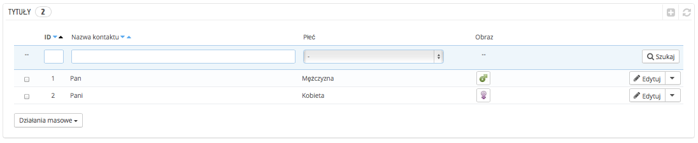
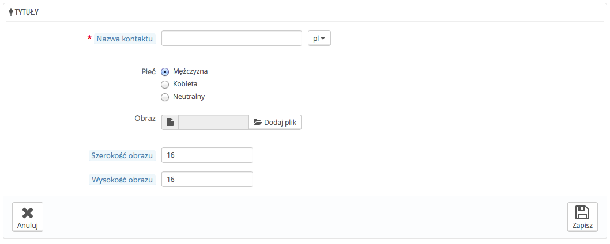

# Zwroty grzecznościowe

Narzędzie zarządzania zwrotami grzecznościowymi pozwala na lepsze grupowanie klientów. Na liście klientów masz możliwość wyboru wyświetlenia osób o określonym zwrocie grzecznościowym. Niektóre moduły mogą również bazować na zwrotach grzecznościowych dla pewnych funkcji.

Po kliknięciu na przycisk “Dodaj nowy tytuł”, wyświetli się następujący formularz:

* **Nazwa**. Możesz wybrać tę, którą uważasz za słuszną. Począwszy od najbardziej konwencjonalnej, np. Pan, Pani, Państwo, do tej rzadziej spotykanej ("Jedi", "Magnificent One", "Money carrier"...). Ważną rzeczą podczas odchodzenia od powszechnie przyjętych tytułów jest fakt, by oddawały one charakter Twojego sklepu.
* **Rodzaj**. Niektóre nazwy mogą dotyczyć zarówno kobiet, jak i mężczyzn, bądź też w ogóle nie odnosić się do jakiekolwiek z płci. Wybierz zatem najbardziej neutralną opcję.
* **Obraz**. Plik odzwierciedlający płeć w rozmiarze 16\*16. Klasyczne symbole płci to Mars i Wenus (♂ i ♀), ale istnieje wiele innych możliwości. PrestaShop pozwala nadać charakter temu, co stworzyłeś za pomocą unikalnego obrazu.
* **Szerokość i wysokość obrazka**. PrestaShop działa lepiej z obrazami o wielkości 16\*16. Jeśli rozmiar zdjęcia będzie większy, PrestaShop automatycznie go zmieni. Niemniej jednak jeśli uznasz, że konieczne jest zastosowanie większych zdjęć, to te dwa pola pozwalają na zdefiniowanie dokładnego rozmiaru wymaganego przez obraz. Jeśli wpiszesz "0", PrestaShop użyje oryginalnego rozmiaru obrazu.
