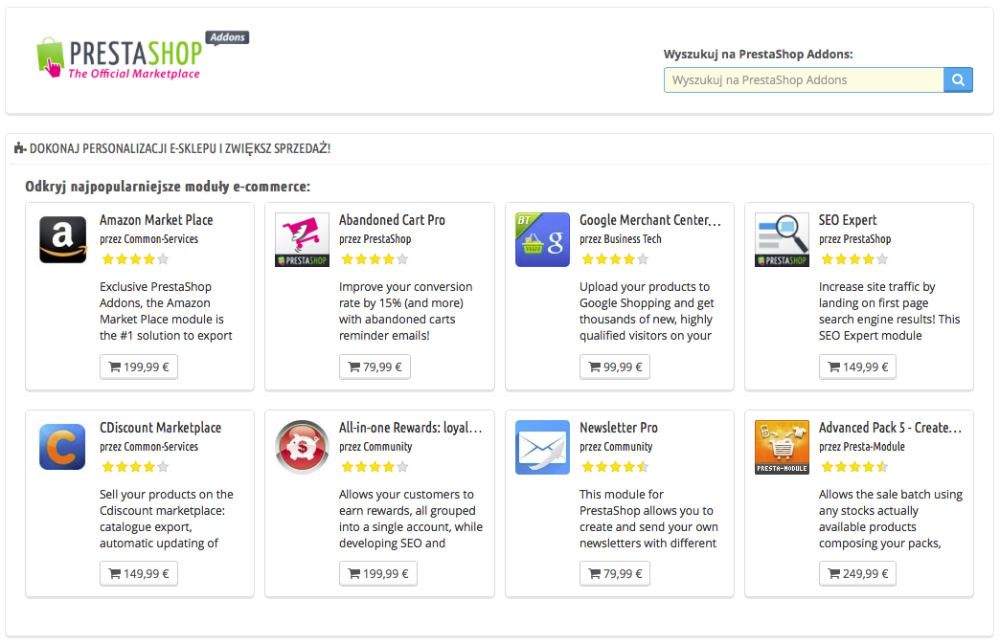
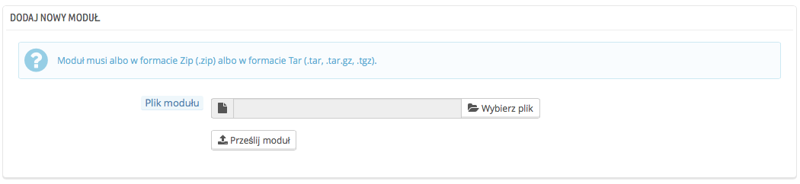
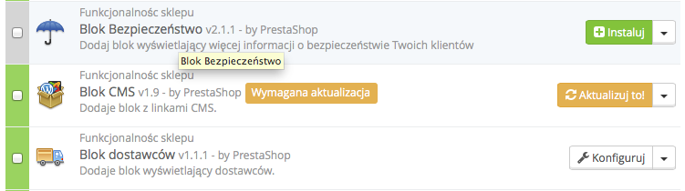
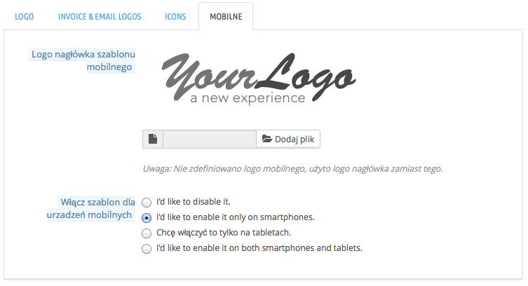

# Katalog modułów i szablonów

\
**Spis zawartości**

/\*\<!\[CDATA\[\*/\
div.rbtoc1597140211605 {padding: 0px;}\
div.rbtoc1597140211605 ul {list-style: disc;margin-left: 0px;}\
div.rbtoc1597140211605 li {margin-left: 0px;padding-left: 0px;}\
\
/\*]]>\*/

* [Katalog modułów i szablonów](katalog-modulow-i-szablonow.md#Katalogmodułówiszablonów-Katalogmodułówiszablonów)
  * [Instalacja modułu](katalog-modulow-i-szablonow.md#Katalogmodułówiszablonów-Instalacjamodułu)
    * [Instalacja polecana](katalog-modulow-i-szablonow.md#Katalogmodułówiszablonów-Instalacjapolecana)
    * [Instalacja za pomocą protokołu FTP](katalog-modulow-i-szablonow.md#Katalogmodułówiszablonów-InstalacjazapomocąprotokołuFTP)
  * [Aktualizacja modułu](katalog-modulow-i-szablonow.md#Katalogmodułówiszablonów-Aktualizacjamodułu)
  * [Odinstalowanie modułu](katalog-modulow-i-szablonow.md#Katalogmodułówiszablonów-Odinstalowaniemodułu)
  * [Instalowanie szablonu](katalog-modulow-i-szablonow.md#Katalogmodułówiszablonów-Instalowanieszablonu)
    * [Instalacja szablonu za pomocą Instalatora PrestaShop](katalog-modulow-i-szablonow.md#Katalogmodułówiszablonów-InstalacjaszablonuzapomocąInstalatoraPrestaShop)
    * [Instalacja za pomocą klienta FTP](katalog-modulow-i-szablonow.md#Katalogmodułówiszablonów-InstalacjazapomocąklientaFTP)
  * [Eksportowanie szablonu](katalog-modulow-i-szablonow.md#Katalogmodułówiszablonów-Eksportowanieszablonu)
  * [Szablon mobilny PrestaShop](katalog-modulow-i-szablonow.md#Katalogmodułówiszablonów-SzablonmobilnyPrestaShop)
    * [Instalacja szablonu mobilnego w Twoim sklepie:](katalog-modulow-i-szablonow.md#Katalogmodułówiszablonów-InstalacjaszablonumobilnegowTwoimsklepie:)
    * [Personalizacja szablonu mobilnego](katalog-modulow-i-szablonow.md#Katalogmodułówiszablonów-Personalizacjaszablonumobilnego)
    * [Używanie szablonu mobilnego z innych szablonem](katalog-modulow-i-szablonow.md#Katalogmodułówiszablonów-Używanieszablonumobilnegozinnychszablonem)

## Katalog modułów i szablonów 

PrestaShop posiada ponad 120 modułów, ale jeśli ta liczba wydaje Ci się mała i niewystarczająca, możesz odkrywać inne możliwości.

Istnieje wiele modułów dostępnych na stronie Addons ([http://addons.prestashop.com/](http://addons.prestashop.com/)). Część jest darmowa, inne są płatne. Z pewnością znajdziesz wśród nich takie, które spełnią Twoje oczekiwania. Jeśli jesteś już doświadczonym programistą/twórcą modułów czy szablonów, możesz zgłaszać stworzone przez siebie moduły i później sprzedawać na stronie Addons.

Katalog modułów i szablonów umożliwia prosty i szybki dostęp do bazy modułów i szablonów Addons. Obsługa jest dość jasna:

* &#x20;Pole wyszukiwania, w którym za pomocą określeń przeszukiwać można całą zawartość bazy Addons.
* &#x20;Lista 8 modułów, które możesz kupić natychmiast.
* &#x20;Lista 12 szablonów, które możesz kupić natychmiast.

Wyszukiwanie w polu wyszukiwania przenosi na stronę Addons, na której pojawiają się dodatkowe opcje.\
Naciśnięcie na przedmiot z listy otworzy stronę Addons w nowej karcie.

Addons jest oficjalnym sklepem dla modułów i szablonów tworzonych pod PrestaShop. To tam właściciele sklepów mogą znaleźć wszystkie niezbędne produkty, potrzebne by spersonalizować sklep. Twórcy i programiści z kolei mogą dzielić się swoimi dziełami ze społecznością.

Moduły mogą być albo darmowe, albo płatne, cena jest ustalona przez autora. Poświęć nieco czasu i przejrzyj dostępne moduły i szablony, ponieważ droższy nie zawsze znaczy lepszy.

Musisz być zalogowany, aby cokolwiek pobrać lub ocenić. Założenie konta jest bezpłatne.

### Instalacja modułu 

Gdy tylko pobrałeś moduł ze sklepu Addons na swój komputer, to do Ciebie należy zainstalowanie go w Twoim sklepie.\
Istnieją dwa sposoby, aby zainstalować moduł: użycie metody polecanej lub protokołu FTP.

#### Instalacja polecana 

Aby zainstalować nowy moduł automatycznie, naciśnij "Dodaj nowy moduł" na stronie "Moduły" u góry po prawej stronie. Pojawi się nowe okno.

Formularz w tej części pozwoli Ci na przesłanie spakowanego pliku z modułem, który został pobrany ze strony Addons. Możesz przesłać plik .zip albo .tar.gz (tarball). Formularz jest dość jasny: wybierz plik modułu, który pobrałeś, a następnie naciśnij "Prześlij moduł". Nie wskazuj do przesłania rozpakowanego folderu ani któregoś z jego plików - tylko i wyłącznie spakowany plik!

Gdy naciśniesz przycisk, PrestaShop pobierze moduł z Twojego komputera na serwer, rozpakuje go, umieści pliki w prawidłowych miejscach i zaktualizuje stronę w przeciągu kilku sekund. W efekcie pojawi się komunikat "Moduł został pobrany".

Moduły nie są instalowane domyślnie: nadal musisz nacisnąć przycisk "Instaluj", a następnie skonfigurować jego ustawienia.\
Gdy tylko konfiguracja będzie zakończona, sprawdź natychmiast, czy moduł działa tak, jak powinien.

#### Instalacja za pomocą protokołu FTP 

Aby zainstalować nowy moduł PrestaShop ręcznie, należy:

1. Rozpakować plik archiwum (`zip` lub `tar`). To powinno utworzyć katalog z jego zawartością.
2. Za pomocą klienta FTP połączyć się z serwerem, na którym znajduje się PrestaShop i umieścić rozpakowany moduł w katalogu `/modules.`\
   Uważaj, żeby nie przesłać przypadkiem zawartości modułu do katalogu innego modułu. Prześlij cały katalog wraz z plikami, a nie tylko same pliki.
3. Przejdź do menu "Moduły" w panelu administracyjnym.
4. Zlokalizuj nowy moduł na liście modułów. Być może będziesz musiał przewinąć listę, aby go odnaleźć, albo wyszukaj go po nazwie.
5. Gdy go znajdziesz, naciśnij "Instaluj".
6. Twój moduł jest teraz zainstalowany i powinien być również aktywny. Jeśli potrzeba, skonfiguruj go. Zwróć także uwagę, czy PrestaShop nie umieścił jakichś ostrzeżeń na stronie.

Gdy tylko konfiguracja będzie skończona, sprawdź natychmiast, czy moduł działa tak, jak powinien.

Ostrzeżenie

Moduły mogą pochodzić z różnych źródeł i nie wszystkie z nich są pewne. Dlatego też PrestaShop wprowadził od wersji 1.6.0.7 ostrzeżenie w przypadku "niezaufanych" modułów - czyli takich, których PrestaShop nie zatwierdził poprzez umieszczenie ich w sklepie Addons. Dzięki temu zadecydujesz czy kontynuować instalację bez kolejnych ostrzeżeń, czy może jej zaprzestać.

.png>)

Instalacja domyślnych modułów albo tych pobranych ze sklepu Addons nie wywoła podobnego ostrzeżenia.

### Aktualizacja modułu 

Twój PrestaShop sprawdza regularnie serwer Addons w poszukiwaniu aktualizacji do zainstalowanych modułów. Jeśli taką znajdzie, wyświetli przycisk "Aktualizuj" przy danym module. Wystarczy wtedy, że naciśniesz przycisk, a PrestaShop pobierze i zaktualizuje moduł.

### Odinstalowanie modułu 

**Nigdy nie usuwaj modułu poprzez usunięcie jego katalogu, używając klienta FTP!** Musisz pozwolić, by PrestaShop zrobił to samodzielnie.

Jeśli chcesz przestać korzystać na jakiś czas z modułu, ale przy tym zachować jego ustawienia, wystarczy, że wybierzesz przycisk "Wyłącz". Pojawią się nowe dostępne czynności: "Włącz", "Usuń" oraz "Odinstaluj".\
Jeśli nie zależy Ci na zachowaniu konfiguracji modułu, naciśnij "Odinstaluj": Twój moduł nadal będzie dostępny w katalogu /modules, ale nie będzie już dalej działał.\
Jeśli chcesz całkowicie usunąć moduł z Twojego sklepu i serwera, wybierz "Usuń". PrestaShop pozbędzie się wszystkich plików.

Upewnij się, że wyłączenie albo usunięcie modułu nie zepsuje wyglądu szablonu!

### Instalowanie szablonu 

Jak tylko pobrałeś szablon ze sklepu Addons, powinieneś go zainstalować.

#### Instalacja szablonu za pomocą Instalatora PrestaShop 

To najbardziej polecana metoda, ponieważ zachowuje ona wszystkie bloki na swoich miejscach.

PrestaShop jest wyposażony w natywny importer szablonów, który jest dostępny na stronie "Szablony" w menu "Preferencje". Naciśnij "Dodaj Szablon" u góry strony (a nie "Dodaj nowy" ponad listą szablonów, gdyż tego przycisku używa się do utworzenia nowego szablonu). Okno, które się następnie pojawi, przedstawia 3 metody instalacji (importu) nowego szablonu: z Twojego komputera, ze strony internetowej, z Twojego własnego serwera FTP. Pozwala również na stworzenie szablonu od zera.

**Importowanie szablonu**

Bez względu na wybrana metodę proces przebiega tak samo: wskaż położenie pliku szablonu w formacie .zip i naciśnij "Zapisz".

Importuj ze swojego komputera: używając okna do przeglądania plików, zlokalizuj swój plik.\
Importuj z sieci Web: wskaż bezpośredni adres URL do archiwum.\
Importuj z FTP: używając klienta FTP, załaduj archiwum do katalogu: `/modules/themeinstallator/import/`

Na następnej stronie pojawi się krótkie podsumowanie wskazujące kolejne czynności importera.

Naciśnij "Następne", aby zatwierdzić swój wybór. Szablon jest teraz zainstalowany, a PrestaShop zapyta, czy chcesz zainstalować moduły, które zostały zaimportowane wraz z szablonem, co chcesz zrobić z obecną konfiguracją modułów i jak chciałbyś, aby została potraktowana konfiguracja zdjęć.

Naciśnij "Następne" po raz ostatni. Pojawi się strona z ostatecznym potwierdzeniem i wszystkie zmiany zostaną wprowadzone w Twoim sklepie. Naciśnij "Zakończ", aby ukończyć cały proces.

#### Instalacja za pomocą klienta FTP 

Ta metoda nie jest polecana, ale nadal dostępna. Używaj jej z rozwagą: Twoje bloki mogą znaleźć się nie tam, gdzie powinny.

Aby zainstalować nowy szablon PrestaShop poprzez FTP, należy:

1. Rozpakować plik archiwum (`zip`). To powinno utworzyć katalog `/themes` zawierający katalog(i) Twojego szablonu.
2. Za pomocą klienta FTP połącz się z serwerem, na którym znajduje się PrestaShop i umieść rozpakowany plik(i) szablonu z katalogu `/themes` w katalogu `/themes` na serwerze. Uważaj, żeby nie przesłać przypadkiem zawartości modułu do katalogu innego modułu. Prześlij cały katalog wraz z plikami, a nie tylko same pliki.
3. (opcjonalnie) Jeśli archiwum szablonu zawiera katalog /modules, oznacza to, że szablon posiada moduły specyficzne dla niego, które umożliwią mu poprawne funkcjonowanie. Za pomocą klienta FTP umieść katalog z /modules w odpowiednim katalogu `/modules` na serwerze. Jeśli na Twoim serwerze znajduje się już moduł o takiej samej nazwie, postaraj się zachować ten bardziej aktualny. Jeśli nie będziesz pewny, to zachowaj ten powiązany z szablonem, prawdopodobnie będzie on najlepiej z nim działać.
4. Idź do panelu administracyjnego, na stronę "Szablony" w menu "Preferencje".
5. Zaznacz nowy szablon w miejscu starego szablonu i naciśnij "Zachowaj".
6. Twój szablon został zainstalowany.
7. (opcjonalnie) Jeśli Twój szablon posiadał moduły, przejdź do menu moduły i skonfiguruj je odpowiednio.

Wiele szablonów posiada plik `Install.txt,` w którym znajdziesz instrukcje dotyczące instalacji. Upewnij się, że postępujesz w odpowiedniej kolejności, aby niczego nie pominąć.

Gdy tylko konfiguracja będzie skończona, sprawdź natychmiast, czy moduł działa tak, jak powinien. Sprawdź wszystko od A do Z, nie chcesz stracić zamówień tylko dlatego, że szablon nie był kompletny!

### Eksportowanie szablonu 

Eksportowanie szablonu jest bardzo przydatne, jeśli chcesz zarchiwizować szablon dla bezpieczeństwa, jak również wtedy, gdy chcesz udostępnić ten szablon komuś innemu, na przykład korzystając ze sklepu Addons ([http://addons.prestashop.com/](http://addons.prestashop.com/)). Ta procedura nie tylko spakuje szablon do pliku .zip, ale także doda wiele informacji w postaci plików XML, które są bardzo przydatne w sklepie Addons i podczas importu szablonu do innego sklepu PrestaShop.

Wybierz szablon, który chcesz eksportować i naciśnij przycisk "Eksportuj motyw". Pojawi się formularz konfiguracji, w którym można określić parametry szablonu: autora, nazwę, kompatybilność, moduły powiązane (jeśli istnieją) itp.

Po uzupełnieniu wszystkiego wybierz przycisk "Zapisz", PrestaShop wygeneruje szybko plik, który można będzie zachować na dysku komputera. Po zachowaniu go można z łatwością się nim dzielić, a jeśli to Ty stworzyłeś szablon, możesz umieścić go w sklepie "Addons".

### Szablon mobilny PrestaShop 

Szablon mobilny daje wszystkim sprzedawcom możliwość zaadaptowania strony do urządzeń mobilnych: od strony głównej po płatność, poprzez stronę produktu i tunel zakupowy.

#### Instalacja szablonu mobilnego w Twoim sklepie: 

Aby zainstalować szablon PrestaShop, należy:

1. Zalogować się do panelu administracyjnego.
2. Przejść na stronę "Szablony" w menu "Preferencje".
3. W części personalizacji wyglądu nacisnąć zakładkę "Mobilne" i przejść do opcji "Włącz szablon dla urządzeń mobilnych". Wybrać jedną z trzech dostępnych opcji (oprócz "Chcę to wyłączyć").

Domyślnie szablon mobilny wyświetla się wyłącznie dla smartfonów, tablety mają ten sam widok, co komputery. Przedstawione opcje pozwalają wybrać, czy szablon mobilny ma być dostępny dla obydwu typów urządzeń, czy tylko dla smartfonów, czy może tylko dla tabletów.

#### Personalizacja szablonu mobilnego 

Pliki szablonu mobilnego znajdują się zawsze w podkatalogu `/mobile` aktualnego szablonu. Jeśli więc Twój aktualny szablon jest szablonem domyślnym, pliki do szablonu mobilnego znajdują się w katalogu: `/themes/default/mobile` PrestaShop.

Szablon składa się z plików HTML, CSS i JavaScript: jego struktura jest taka sama, jak w przypadku szablonu domyślnego, ale przy ustawieniach całkowicie odmiennych, przystosowanych do małych ekranów urządzeń mobilnych.

Jeśli więc chcesz zmienić kolory wyświetlania albo inne elementy w wersji mobilnej, musisz edytować pliki CSS/HTML i dokonać zmian zgodnie z Twoim gustem. Musisz jednakże posiadać pewną wiedzę w programowaniu sieciowym albo zwrócić się o pomoc do osoby o odpowiednich umiejętnościach.

#### Używanie szablonu mobilnego z innych szablonem 

Szablon mobilny jest dostępny wyłącznie w sytuacji, gdy aktualny szablon posiada podkatalog `/mobile` w swoim katalogu. Wiele szablonów PrestaShop nie posiada szablonu mobilnego i użytkownicy tych szablonów nie mogą zaproponować klientom wersji mobilnej sklepu.

Czekając na aktualizację Twojego aktualnego szablonu do wersji mobilnej, możesz skorzystać z domyślnej wersji mobilnej dzięki szybkiemu manewrowi: wystarczy skopiować podkatalog `/mobile` z katalogu `/themes/default` a następnie wkleić podkatalog w katalogu Twojego aktualnego szablonu.

W ten sposób możesz używać domyślnego szablonu mobilnego, który może nie jest spójny graficznie z aktualnie używanym szablonem, ale nic nie stoi na przeszkodzie, żeby zmodyfikować nieco szablon mobilny i zbliżyć jego wygląd do bieżącego motywu graficznego.
