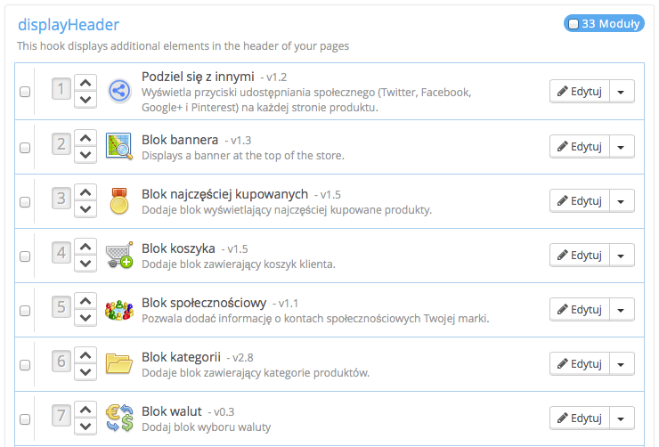
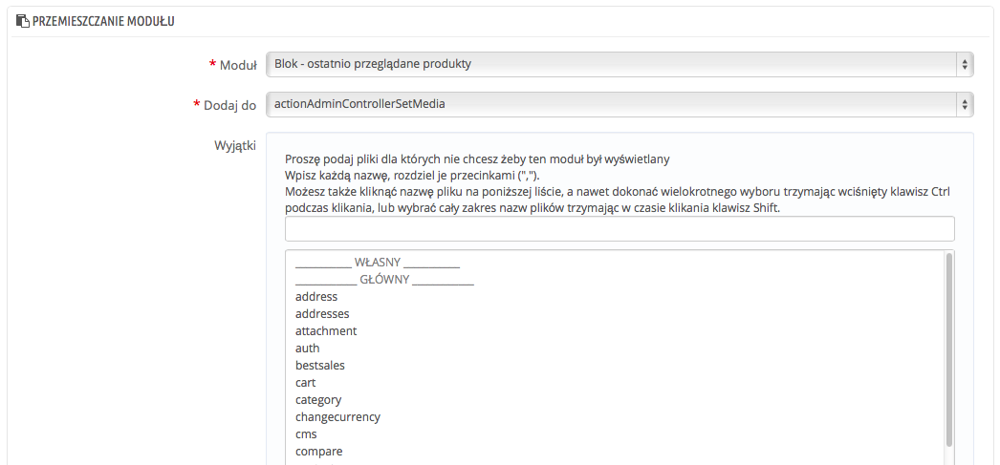
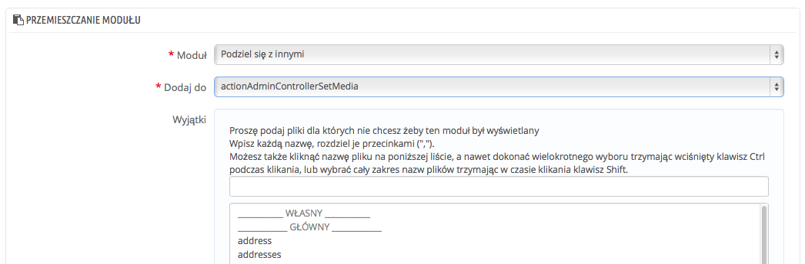
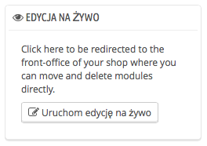

# Pozycje we Front-Office

/\*\<!\[CDATA\[\*/\
div.rbtoc1597140211841 {padding: 0px;}\
div.rbtoc1597140211841 ul {list-style: disc;margin-left: 0px;}\
div.rbtoc1597140211841 li {margin-left: 0px;padding-left: 0px;}\
\
/\*]]>\*/

* [Pozycje we Front-Office](pozycje-we-front-office.md#PozycjeweFront-Office-PozycjeweFront-Office)
  * [Przemieszczenie modułu do węzła zaczepienia](pozycje-we-front-office.md#PozycjeweFront-Office-Przemieszczeniemodułudowęzłazaczepienia)
  * [Przypisanie modułu do węzła przypisania: Przemieszczenie](pozycje-we-front-office.md#PozycjeweFront-Office-Przypisaniemodułudowęzłaprzypisania:Przemieszczenie)
  * [Modyfikacja modułu przemieszczonego](pozycje-we-front-office.md#PozycjeweFront-Office-Modyfikacjamodułuprzemieszczonego)
  * [Usunięcie modułu z węzła](pozycje-we-front-office.md#PozycjeweFront-Office-Usunięciemodułuzwęzła)
  * [Przemieszczanie modułów wizualnie: Edycja na żywo](pozycje-we-front-office.md#PozycjeweFront-Office-Przemieszczaniemodułówwizualnie:Edycjanażywo)
    * [Gdzie przemieszczać moduły?](pozycje-we-front-office.md#PozycjeweFront-Office-Gdzieprzemieszczaćmoduły?)
  * [Przemieszczanie modułu poprzez zmiany w kodzie](pozycje-we-front-office.md#PozycjeweFront-Office-Przemieszczaniemodułupoprzezzmianywkodzie)

Moduły często posiadają dwa widoki: Jeden w back-office (jego opcje, ekran konfiguracji etc), i drugi we Front-Office. Front-Office odpowiada za sposób oraz położenie modułu w obrębie szablonu Twojego sklepu.

Kolejność, według której moduły pojawiają się w Twoim szablonie może być zmieniana zgodnie z Twoimi oczekiwaniami. Możesz chcieć, żeby jakiś blok modułu znajdował się powyżej lub poniżej innych elementów strony. W żargonie PrestaShop nazywa się to przemieszczeniem, a używa się do tego narzędzia dostępnego w menu Moduły->Pozycje. Pozwala ono na niejako "przyczepienie" modułu do jednego z kilku węzłów zaczepienia dostępnych w aktualnym szablonie, bez pisania czegokolwiek w kodzie strony.

Strona "Pozycje" wyświetla wszystkie dostępne węzły zaczepienia, a także przypisane do nich odpowiednie moduły. Wiele węzłów jest domyślnie pustych, ale te najczęściej używane mają dziesiątki modułów (np. punkt displayHeader posiada domyślnie 34 moduły).



U góry strony znajduje się rozwijane menu, które pozwala na ograniczenie widoku do punktu, który Cię interesuje.\
Domyślnie lista ta pokazuje wyłącznie węzły, gdzie możesz dodać funkcje. Zaznacz "Wyświetl niepozycjonowalne węzły", aby wyświetlić wszystkie węzły, nawet te, gdzie nie możesz nic przenieść.

W nagłówku każdego węzła znajduje się jego nazwa techniczna oraz liczba przypisanych modułów. Tabela poniżej wyświetla je wszystkie.

Moduły są przedstawione w kolejności, z jaką pojawiają się w węźle.

## Przemieszczenie modułu do węzła zaczepienia <a href="#pozycjewefront-office-przemieszczeniemoduludowezlazaczepienia" id="pozycjewefront-office-przemieszczeniemoduludowezlazaczepienia"></a>

Istnieją dwa sposoby na przeniesienie modułu do węzła:

* Naciśnięcie strzałki do góry/ w dół, aby zmienić kolejność modułu w węźle. Strona następnie zaktualizuje się i pokaże nową kolejność.
* Przeciągnięcie i upuszczenie modułu na odpowiednią pozycję w ramach węzła:\

  1. Umieść kursor na numerze pozycji modułu, kursor zmieni się w krzyżyk.
  2. Przeciągnij moduł na wybraną pozycję, ramka z modułem zostanie tam przeniesiona.
  3. Upuść moduł, a jego pozycja zostanie zmieniona i zapisana.

Dla większości modułów przemieszczenie można wykonać łatwo z poziomu Back-Office. Niemniej jednak istnieją moduły, które wymagają zmian bezpośrednio w kodzie.

## Przypisanie modułu do węzła przypisania: Przemieszczenie <a href="#pozycjewefront-office-przypisaniemoduludowezlaprzypisania-przemieszczenie" id="pozycjewefront-office-przypisaniemoduludowezlaprzypisania-przemieszczenie"></a>

W PrestaShop czynność "przemieszczenia" modułu polega na przypisaniu go do konkretnego węzła. Możecie przypisać moduł do więcej niż jednego węzła.

Są dwie ważne kwestie przed przypisaniem modułu:

* Niektóre moduły są ograniczone do przypisania wyłącznie dla wybranych węzłów.
* Niektóre węzły są stworzone, aby przyjmować tylko niektóre moduły.

Bądź świadom po prostu, że nie zawsze będziesz mógł przypisać każdy moduł do każdego węzła.

Upewnij się że wyłączyłeś pamięć podręczną przeglądarki (cache) podczas testowania nowego modułu. Można ją wyłączyć w menu Zaawansowane->Wydajność.

Proces przemieszczenia posiada własny interfejs:

1\. Przejdź na stronę "Pozycje" w menu "Moduły".\
&#x20;2\. Naciśnij przycisk "Przemieszczanie modułu" u góry po prawej. Pokaże się interfejs, gdzie wyświetli się wiele modułów.\
&#x20;3\. Z listy rozwijanej "Moduł" wybierz ten moduł, który chcesz przemieścić.\
&#x20;4\. Z listy rozwijanej "Dodaj do", wybierz miejsce, do którego chcesz przypiąć moduł.\
&#x20;5\. W polu "Wyjątki" podaj nazwę odpowiedniego(ch) pliku(ów) odnoszącą się do stron, na których moduł ma się nie wyświetlać.\
&#x20;Można dokonać licznego wyboru, klikając na pliki przyciskając jednocześnie klawisz CTRL. Odznacz pliki także w ten sam sposób: CTRL + przycisk myszy.\
&#x20;6\. Nie zapomnij na końcu zachować zmian.



Menu rozwijane "Dodaj do" pomaga określić, gdzie moduł może być przypięty.

Nawet jeśli lista daje kompletny obraz dostępnych węzłów, nie musi być ona dostatecznie jasna, jeśli chodzi o dodanie do konkretnego węzła. Nie krępuj się próbować z innymi węzłami, jeśli otrzymany rezultat nie odpowiada Twoim oczekiwaniom.

## Modyfikacja modułu przemieszczonego <a href="#pozycjewefront-office-modyfikacjamoduluprzemieszczonego" id="pozycjewefront-office-modyfikacjamoduluprzemieszczonego"></a>

Każdy moduł posiada dwa przyciski na prawo w swojej komórce: jeden, aby modyfikować jego ustawienia, drugi, do odczepienia modułu.

Modyfikacje modułu odbywają się w tym samym miejscu, co w przypadku procesu przemieszczenia. Główna różnica sprowadza się do tego, że nie można zmienić pól "Moduł" oraz "Dodaj do", które są nieaktywne. Można tylko modyfikować pole "Wyjątki", które funkcjonuje jak w przypadku procesu przemieszczenia opisanego powyżej.\
Chociaż nie możesz modyfikować pól "Moduł" i "Dodaj do", to mogą one służyć jako przypomnienie aktualnej pozycji modułu, jeśli później będziesz chciał go przenieść.



Aby przenieść moduł do innego węzła, użyć interfejsu przemieszczenia:

1. Naciśnij przycisk "Przemieszczanie modułu" u góry na prawo. Pokaże się interfejs, gdzie wyświetli się wiele modułów.
2. Na rozwijanej liście "Moduł", wybierz moduł który chcesz przemieścić.
3. Z listy rozwijanej "Dodaj do", wybierz miejsce, gdzie chcesz przypiąć moduł.
4. W polu "Wyjątki" podaj nazwę odpowiedniego(nich) pliku(ów) odnoszącą(e) się do stron na których nie chcesz, aby moduł się wyświetlał.
5. &#x20;Zapisz zmiany. Pojawi się lista węzłów.
6. Przejdź do węzła gdzie przemieściłeś moduł, powinien być tam obecny, w razie potrzeby zmień jego kolejność.
7. przejdź do węzła, gdzie moduł znajdował się pierwotnie, i naciśnij na ikonę "Odepnij", aby usunąć go z tego miejsca. To pozwala uniknąć podwójnego pojawiania się tego samego modułu.

\
Zawsze sprawdź, czy moduł pojawił się tam, gdzie powinien.

## Usunięcie modułu z węzła <a href="#pozycjewefront-office-usunieciemoduluzwezla" id="pozycjewefront-office-usunieciemoduluzwezla"></a>

Moduł można usunąć z węzła na dwa sposoby:

* usunąć jeden moduł: naciśnij na ikonę "Odepnij" po prawej stronie okna modułu.
* usunąć wiele modułów: zaznacz kilka kolejnych modułów, w polu po lewej stronie każdego modułu, a następnie naciśnij przycisk na dole strony: "Uwolnij (unhook) wybrane".

## Przemieszczanie modułów wizualnie: Edycja na żywo <a href="#pozycjewefront-office-przemieszczaniemodulowwizualnie-edycjanazywo" id="pozycjewefront-office-przemieszczaniemodulowwizualnie-edycjanazywo"></a>

Innym sposobem na przemieszczanie modułów jest zmiana ich pozycji w podglądzie na żywo który integruje stronę główną z narzędziem, które pozwoli CI na przemieszczenie wizualne modułów. Możesz przejść tam przechodząc przez menu Moduły, podstrona "Pozycje", po prawej stronie znajduje się przycisk "Uruchom edycję na żywo".



Po naciśnięciu PrestaShop otworzy stronę główną w nowej zakładce, wraz z uruchomioną edycją na żywo:

* Wszystkie bloki będą otoczone czerwoną ramką, co pozwoli Ci na określenie, które bloki można przemieścić.
* W lewym rogu ramki znajduje się nazwa bieżącej ramki.
* W prawy rogu ramki znajdują się dwie ikony:\

  1. Ikona do przemieszczania, naciśnij ją aby zmień położenie danego bloku.
  2. Ikona "kosz", która pozwala na odczepienie (usunięcie" danego bloku.


Na górze okna, znajdują się dwa przyciski, "Zapisz" oraz "Zamknij edycję na żywo".\
Pierwszy pozwala zapisać wszelkie dokonany zmiany, drugi zamyka okno bez zapisywania zmian.

Pamiętaj, że po usunięciu modułu, musisz iść na stronę "Pozycje" i użyć formularza "Przemieszczanie modułu", aby ponownie go umieść w sklepie.

### Gdzie przemieszczać moduły? <a href="#pozycjewefront-office-gdzieprzemieszczacmoduly" id="pozycjewefront-office-gdzieprzemieszczacmoduly"></a>

Moduły nie mogą być przemieszczone nie wiadomo gdzie: Wszystko zależy od węzłów danego szablonu i od tego z z czym dany węzeł może funkcjonować. W wyniku tego można przemieszczać modułu tylko w ich wybranym kontekście: moduły kolumn mogą być przemieszczone do środka kolumny, albo do innej kolumny, podczas gdy moduły strony głównej (te z środka strony) mogą być przemieszczone tylko w określone strefy.

Aby dać temu wyraz wizualnie, PrestaShop wskaże, gdzie moduł może być przeniesiony otaczając prawidłowe bloki zielonym tłem i obramowaniem, a złe czerwonym (w edycji na żywo).

## Przemieszczanie modułu poprzez zmiany w kodzie <a href="#pozycjewefront-office-przemieszczaniemodulupoprzezzmianywkodzie" id="pozycjewefront-office-przemieszczaniemodulupoprzezzmianywkodzie"></a>

Dotyczy to tylko ekspertów: musisz znać dobrze HTML i PHP aby zmienić cokolwiek w kodzie modułu

Niektóre moduły nie mogą być przypisane do innych stron ponieważ nie posiadają odpowiedniego kodu.

Na przykład blok "Szybkie wyszukiwanie" `/blocksearch` zawiera jednocześnie sposoby wyświetlania jaki i wyświetlanie w nagłówku, podczas gdy blok "Waluty"(`/blockcurrencies`) posiada tylko jeden plik który odnosi się wyłącznie do nagłówka; Tak samo blok "Produkty promowane na stronie głównej" `(/homefeatured`) może być wyświetlony wyłącznie w części centralnej strony.

Jeśli chcesz umieścić proste moduły jak "Waluty" w miejscu, dla którego nie zostało to przewidziane, musisz sam dokonać zmian w kodzie.\
Moduły bardziej zaawansowane jak "Produkty promowane na stronie głównej" mogą być również zmodyfikowane do wyświetlania się na innych stronach, ale to wymaga przepisania części kodu aby mogły one funkcjonować prawidłowo.

aby spersonalizować przemieszczenie modułu do węzła należy określić jego funkcję PHP dla danego punktu. Weźmy na przykład blok "Waluty":

```
function hookTop($params)
  {
  ...
  }
```

Aby przemieścić blok "Waluty" do prawej kolumny na przykład, musisz dodać funkcję hookRightColumn():&#x20;

```
function hookRightColumn($params)
  {
  ...
  }
```

Następnie musisz napisać kod, który wyświetli zawartość w kolumnie. W najlepszym razie wystarczy przekopiować zwartość funkcji `hookTop()`, w najgorszym trzeba będzie przypisać zawartość tej funkcji, aby zaczęła funkcjonować w nowej części.
