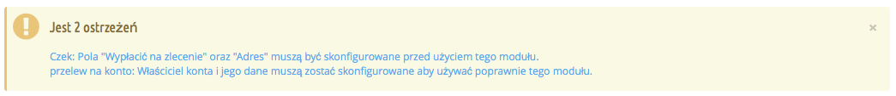
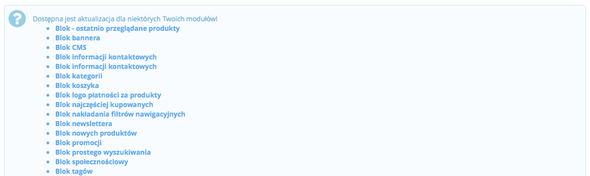
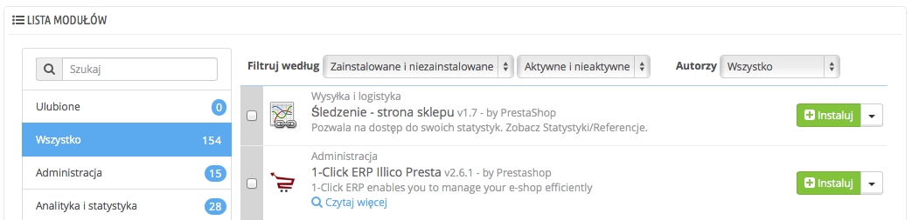
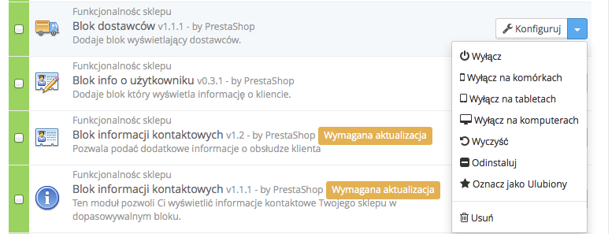

# Twoje moduły

Strona "Moduły" w menu "Moduły" otwiera dostęp do listy modułów. Na tej stronie możesz instalować, odinstalowywać, konfigurować i aktualizować każdy moduł. Wszystkie moduły natywne są objaśnione w rozdziale im poświęconym. Ten rozdział wyjaśnia jedynie, jak działa strona modułów.

## Powiadomienia 

Poniżej nazwy strony są widoczne powiadomienia, które będziesz otrzymywać po zainstalowaniu modułu. W większości przypadków powiadomienia pomogą Ci dokończyć konfigurację modułów, które zostały zainstalowane, ale nie są jeszcze gotowe do użycia: aktualizacja ich ustawień powinna sprawić, że powiadomienie zniknie, a moduł będzie działał prawidłowo.

Jeśli na stronie Addons pojawi się aktualizacja dla któregoś z Twoich modułów, PrestaShop da Ci o tym znać. Pojawi się przycisk "Uaktualnij wszystko" u góry strony. Naciśnij go, by zaktualizować wszystkie wymienione moduły.

## Lista modułów 

Ta lista pozwala na szybkie odnalezienie modułu, który chcesz zainstalować albo którego ustawienia chcesz zmienić.\
W pierwszej części możesz szukać określonego modułu albo filtrować moduły, dopóki nie znajdziesz tego, którego szukasz.

* **Pole wyszukiwania.** Moduły zaczną się pojawiać, kiedy zaczniesz wpisywać ich nazwę.
* **Listy filtrowania.** Lista modułów automatycznie zostanie przeładowana po wyborze ustawienia i pojawią się moduły zgodne ze wszystkimi ustawieniami.
*
  * **Zainstalowane i niezainstalowane.** Bardzo prawdopodobne, że będziesz chciał zmienić coś w zainstalowanym module albo zainstalować nowy. To filtrowanie jest używane najczęściej.
  * **Aktywne i nieaktywne.** Tylko zainstalowane moduły można konfigurować, stąd ten sposób filtrowania
  * **Autorzy.** Możesz filtrować moduły po autorach. Standardowo tylko moduły autorstwa "PrestaShop" są dostępne, ale gdy dodasz inne moduły, ten filtr okaże się bardzo przydatny.

Po lewej stronie znajduje się lista wszystkich kategorii modułów wraz z liczbą modułów w nich dostępnych. Wybierz kategorię, aby zobaczyć moduły przynależne wyłącznie do niej.\
Jedna z kategorii nazywa się "Ulubione" i jest pusta. Pozwoli ona na zebranie modułów, z których korzystasz najczęściej i szybki do nich dostęp. Za pomocą polecenia "Oznacz jako ulubiony" (dostępnego pod trójkątem przy poleceniu "Instaluj"), możesz dodać wybrany moduł do ulubionych.

Moduły mogą mieć 4 statusy aktywności:

* Niezainstalowany.
* Zainstalowany, ale nieaktywny.
* Zainstalowany i aktywny.
* Zainstalowany i aktywny, ale z ostrzeżeniami.

Niektóre moduły posiadają znaczek "Popularne". Pochodzą one ze strony Addons i są płatne. Przycisk "Instaluj" został w ich przypadku zastąpiony znaczkiem z koszykiem zakupowym oraz ceną modułu. Jego naciśnięcie przenosi na stronę, na której można kupić moduł.

Różnica pomiędzy wyłączeniem a odinstalowaniem

Kiedy nie musisz dłużej używać jakiegoś modułu, możesz go albo odinstalować, albo wyłączyć. Efekty obu czynności są niemal takie same: moduł nie jest dostępny, jego opcje nie będą już widoczne w panelu administracyjnym i jakikolwiek element, który dodawał on na stronie sklepu, zniknie.

Różnica polega na tym, że ustawienia modułu w przypadku jego wyłączenia zostaną zachowane na wypadek jego ponownego włączenia, podczas gdy odinstalowanie usuwa wszelkie dane powiązane z tym modułem.

Dlatego też powinno się odinstalowywać moduły wyłącznie w przypadku, gdy nie interesują Cię informacje z nimi powiązane i ich nie potrzebujesz. Jeśli jesteś pewien, że na pewno nie potrzebujesz tego modułu, możesz nawet nacisnąć przycisk "Usuń".

## Wykonywanie czynności na modułach 

Oto działania możliwe do wykonania w zależności od statusu modułu:

* Niezainstalowane moduły:\

  * **Instaluj.** Rozpocznie się instalacja modułu w PrestaShop. Moduł zostanie automatycznie włączony i może dodać nowe opcje w Twoim panelu administracyjnym.
  * **Oznacz jako Ulubiony.** Moduł zostanie dodany do listy Ulubionych.
* Zainstalowane moduły:\

  * **Konfiguruj.** Niektóre moduły posiadają stronę konfiguracji. W tym przypadku oferują link do konfiguracji, pod którym właściciel sklepu będzie mógł uzupełnić wszystkie ustawienia.
  * **Wyłącz.** Po zainstalowaniu moduł zostaje automatycznie włączony. Możesz go wyłączyć, co usunie z panelu administracyjnego wszystkie jego funkcje, ale pozostawi w pamięci wszelkie ustawienia, na wypadek ponownego uruchomienia.\

    * **Włącz/Wyłącz na komórkach.** To wyłączy działanie modułu na stronie sklepu przeglądanej na urządzeniach mobilnych (smartfonach i in.)
    * **Włącz/Wyłącz na tabletach.** To wyłączy działanie modułu na stronie sklepu przeglądanej tylko na tabletach.
    * **Włącz/Wyłącz na komputerach.** To wyłączy działanie modułu na stronie sklepu przeglądanej tylko na komputerach.
  * **Wyczyść.** To przywraca ustawienia modułu do ich domyślnej wartości.
  * **Odinstaluj.** To polecenie wyłączy moduł i usunie dane z nim powiązane.
  * **Oznacz jako Ulubiony.** To pozwoli dodać moduł do ulubionych.
  * **Usuń.** To usunie całkowicie moduł z listy modułów i wymaże wszystkie dane z nim powiązane.

Najlepiej oceniane moduły ze strony Addons mogą być promowane na liście Twoich modułów w zależności od ustawień lokalnych sklepu. Pojawiają się one wśród innych modułów, ale przyciski akcji z nimi powiązane nie są oznaczone jako "Instaluj", tylko pokazują cenę np. "30€". Naciśnięcie tego przycisku przeniesie Cię na stronę modułu, na której można go kupić, pobrać i zainstalować w sklepie.

## Łączenie się ze stroną Addons 

W podstawowej konfiguracji strona "Moduły" pozwala wyłącznie na aktualizację modułów standardowych, czyli tych dołączonych do PrestaShop. Jeśli kupiłeś moduły na stronie Addons i chcesz, by także one automatycznie się aktualizowały, musisz połączyć swój sklep PrestaShop z Addons.

Naciśnij na "Brak połączenia z PrestaShop Addons" u góry strony. To wywoła okno logowania. Wypełnij je swoimi danymi potrzebnymi do logowania, a PrestaShop będzie mógł aktualizować zakupione tam przez Ciebie moduły. Po zalogowaniu pod tym linkiem możesz zobaczyć status Twojego zalogowania.

| .png>) | .png>) |
| ------------------------------------------------ | ------------------------------------------------ |

Jeśli moduły się nie aktualizują, sprawdź na wszelki wypadek, czy nadal jesteś zalogowany.
