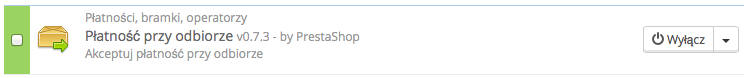
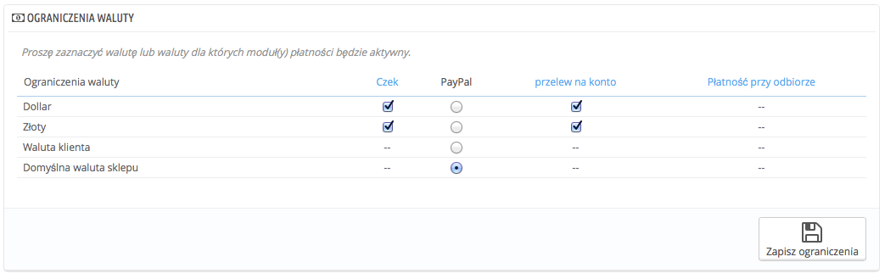
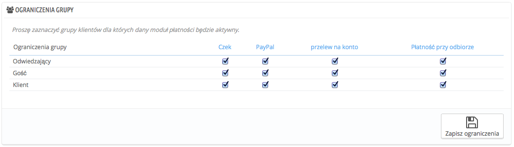
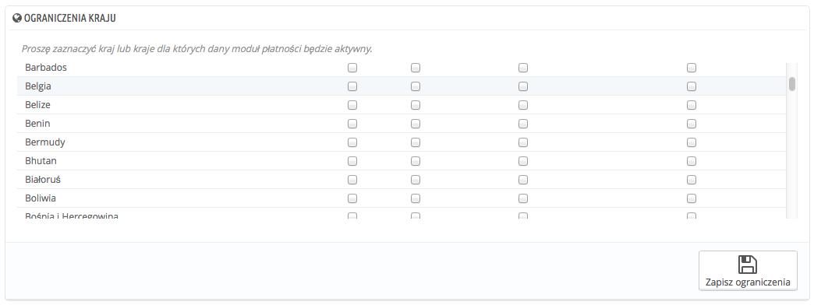

# Ustawienia płatności

W PrestaShop można akceptować transakcje pochodzące z różnych źródeł płatności, takich jak czeki, przelewy, płatność za pobraniem etc. w ramach usług świadczonych przez licznych dostawców płatności, takich jak PayPal, Skrill, Hipay etc.

Na stronie "Płatność" możesz znaleźć następujące części:

* Lista zainstalowanych modułów, na której można dokonać bezpośredniej konfiguracji zainstalowanych modułów.
* Rekomendowane Bramki płatności - tam znajdują się rekomendowane moduły do zainstalowania (płatne i bezpłatne).
* Trzy pola ograniczeń:\

  * **Ograniczenia waluty.** Wybierz waluty, które Twoje moduły mają akceptować.
  * **Ograniczenia grupy.** Wybierz, jakie grupy użytkowników mogą korzystać z wybranych sposobów płatności.
  * **Ograniczenia kraju.** Wybierz kraje, których użytkownicy mogą korzystać z wybranych sposobów płatności.

## Instalacja modułu płatności 

Instalacja modułu płatności nie różni się znacznie od instalacji każdego innego modułu: Wystarczy nacisnąć przycisk "Instaluj", a następnie skonfigurować moduł. Należy zwrócić szczególną uwagę na poprawną konfigurację modułu i upewnić się, że Twoje dane osobowe oraz dane konta bankowego są prawidłowe. Konfiguracja modułu płatności wymaga, by najpierw posiadać założone konto u wybranego dostawcy płatności.

Zainstalujmy moduł "Płatność przy odbiorze". Znajdź ten moduł na liście i następnie naciśnij "Instaluj". PrestaShop zajmie się resztą, odświeżając stronę z listą modułów i informując o rezultatach instalacji. Na przykład jeśli moduł będzie wymagał konfiguracji, stosowne powiadomienie pojawi się u góry strony. W przypadku tego modułu nie ma nic do konfigurowania.

## Ograniczenia modułów płatności w odniesieniu do waluty 

W ramach określonej metody płatności opcje mogą się różnić.\
Możesz ograniczyć wybór dostępnych metod płatności do konkretnych walut: przykładowo, klient po wyborze modułu PayPal może płacić za pomocą jakiejkolwiek waluty, ale ci, którzy chcą używać Skrill mogą płacić wyłącznie dolarami:

Domyślnie tylko jedna waluta jest dostępna w Twoim sklepie. Jeśli chcesz to zmienić, zrób, co następuje:

1. Na stronie "Lokalizacja" menu "Lokalizacja", zaimportuj paczkę z lokalizacją kraju, który Cię interesuje. Na przykład wybierz USA dla dolara, Wielką Brytanię dla funta etc.
2. Na stronie "Waluty" w menu "Lokalizacje", aktywuj właśnie zaimportowaną walutę.

Jeśli musisz ograniczyć użycie modułu na podstawie waluty użytkownika, zaznacz po prostu opcje, które Ci odpowiadają i naciśnij "Zapisz ograniczenia".

Zauważ, że ograniczenia walut działają w różny sposób  w zależności od danego modułu płatności:

* dla niektórych, jak w przypadku płatności przy odbiorze, nie można zmienić domyślnych ustawień.
* dla innych, jak przelew, czek, Skrill etc, można zmienić wszystkie ustawienia oprócz "Waluta klienta" oraz "Domyślna waluta sklepu".
* następnie, dla jeszcze innych modułów, jak PayPal czy Hipay, można zmienić ustawienia walut, ale trzeba wybrać pomiędzy "Walutą klienta" albo "Domyślną walutą sklepu, nie obiema jednocześnie.

Klient może wybrać swoją walutę z rozwijanego menu na każdej stronie Front-Office.

Domyślną walutę sklepu ustawia się na stronie Lokalizacja->Lokalizacja.

Jeśli zmienisz domyślną walutę już po skonfigurowaniu niektórych produktów, konieczne będzie ponowne ustawienie wszystkich cen. Waluta domyślna powinna zostać określona przed dodaniem jakiegokolwiek produktu.

## &#x20;Ograniczenia grupy 

&#x20;Określonym grupom klientów można zawęzić wybór metod płatności.

Dla przykładu, zwyczajni klienci sklepu będą płacili za pomocą PayPal czy Skrill etc, podczas gdy firmy mogą płacić wyłącznie za pomocą przelewów. W zależności zatem od typu klientów, jak i Twoich decyzji, dla poszczególnych grup klientów zastosowanie mogą mieć tylko niektóre metody płatności.

## Ograniczenia kraju 

Można również powiązać wybór danej metody płatności z krajem pochodzenia klienta. Na przykład, możesz akceptować wszystkie metody płatności dla klientów z Francji, Polski i Niemiec, podczas gdy użytkownicy z Włoch i USA będą korzystali tylko z przelewu bankowego.

Tabela wyświetla wszystkie znane kraje. Jeśli jakiegoś brakuje, możesz dodać go na stronie "Kraje" w menu "Lokalizacja".

I tu, ponownie jak w przypadku ograniczeń walut, opcje płatności zależą od modułu płatności:

* dla niektórych, jedyną opcją jest kraj Twojego sklepu.
* dla innych, dostępne opcje płatności zależne są od państw, które obsługują daną metodę.
* wszystkie pozostałe natywne moduły płatności powinny działać we wszystkich krajach.

Znajdź kraj, którego szukasz, według alfabetycznej listy i zaznacz/odznacz odpowiednie pola dla metod płatności, które chcesz udostępnić użytkownikom z danego kraju. Gdy tylko wszystkie ustawienia zostaną skonfigurowane, naciśnij "Zachowaj ograniczenia" u dołu tabeli.

Domyślnie wszystkie metody płatności są włączone dla kraju sklepu.
