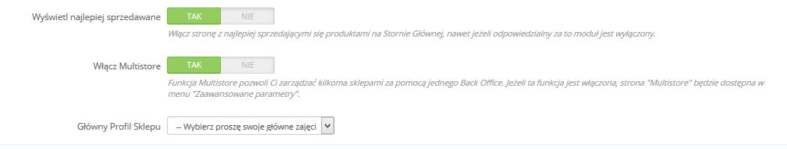

# Zarządzanie Multisklepem

Jedną z najatrakcyjniejszych funkcjonalności PrestaShopa jest Multisklep (Multistore), który pozwala na zarządzanie wieloma sklepami z jednego, wspólnego back-office.

Dzięki tej funkcji możesz zarządzać wieloma spersonalizowanymi sklepami, które dzielą wiele wspólnych elementów. Możesz nawet tworzyć grupy sklepów, dla większej wydajności.

## Jak określić, czy potrzebujesz Multisklepu 

Może być tak, że będziesz uważać, iż należy skorzystać z funkcjonalności "Mulitsklep", podczas gdy nie będzie to niezbędne, na przykład wtedy, gdy chcesz stworzyć sklep wielojęzyczny albo chcesz używać więcej niż jednej waluty, albo chciałbyś mieć inny szablon dla każdej kategorii.

Dwa pytania powinieneś zadać sobie przed uruchomieniem tej funkcjonalności

1. &#x20;Czy chcesz, żeby sklepy posiadały dwie różne ceny dla tego samego produktu (wyłączając z tego kwestię upustów dla klienta albo grupy klientów)\
   &#x20;**Jeśli odpowiedź brzmi "tak", to powinieneś uruchomić multisklep.**\
   ****
2. Jeśli klient kupuje w jednym sklepie, ale nie chcesz, żeby posiadał dostęp do historii swoich zamówień z drugiego sklepu(nawet jeśli klient posiada te same dane dostępowe do obydwu sklepów).\
   **Jeśli odpowiedź brzmi "tak", to powinieneś uruchomić multisklep**: te sklepy nie będą dzielić koszyków oraz zamówień, a produkty dodawane w sklepie nr 1 nie będą widoczne w sklepie nr 2.

Jeśli odpowiedź brzmi "nie" na obydwa pytania, wtedy multisklep nie jest rozwiązaniem.

## Uruchamiania multisklepu 

Przekształcenie twojego pojedynczego sklepu PrestaShop w multisklep jest proste:

1. Zaloguj się do back-office.
2. Idź do menu Preferencje->Ogólny..
3. Znajdź opcję "Włącz Mutlistore" i włącz ją..
4. Zachowaj zmiany.

I gotowe: funkcja multisklepu została uruchomiona, pojawiła się również podstrona "Multisklep" w menu "Zaawansowane". Stamtąd będzie można zarządzać wieloma sklepami stworzonymi za pomocą PrestaShop.

## Korzystanie z funkcjonalności multisklep 

* [Interfejs Mutlisklepu](interfejs-mutlisklepu.md)
* [Tworzenie nowej grupy sklepów](tworzenie-nowej-grupy-sklepow.md)
* [Tworzenie nowego sklepu](tworzenie-nowego-sklepu.md)
* [Ustalanie nowego adresu URL sklepu](ustalanie-nowego-adresu-url-sklepu.md)
* [Przykładowe użycie i specyfika](przykladowe-uzycie-i-specyfika.md)
