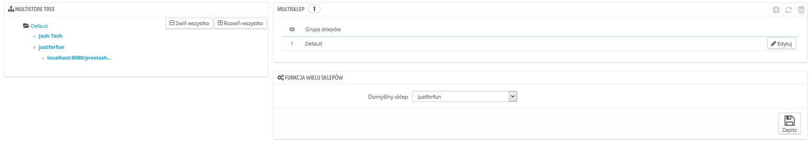
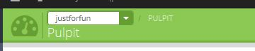
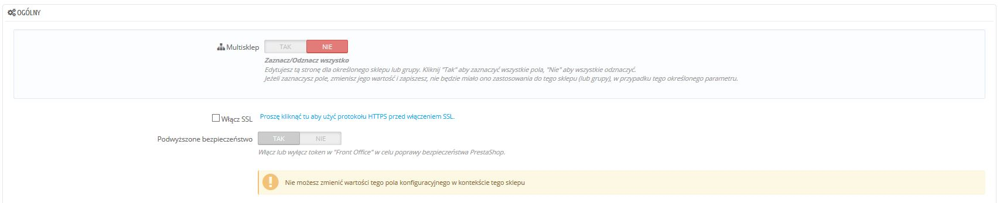

# Interfejs Mutlisklepu

## Zarządzanie sklepami 

Strona "Multisklep" składa się z trzech części:

* **Multistore tree**.  Daje Ci podgląd na grupy sklepów, ich sklepy, a nawet adresy URL powiązane z jednym sklepem.\
  &#x20;Domyślnie jest tylko jeden sklep w grupie domyślnej: główny sklep.
* **Tabela Multisklep.** Przedstawia listę dostępnych grup sklepów. Możesz je zmieniać naciskając przycisk "Edytuj" po prawej.
* **Funkcja wielu sklepów.** Przedstawia listę  dostępnych opcji dla istniejących sklepów.\

  * **Sklep domyślny**. Sklep domyślny będzie służyć jako centrala dla wszystkich innych sklepów, będzie współdzielił informacje z innymi sklepami (produkty,przewoźników etc).

## Jeden Back-Office, aby rządzić wszystkimi 

Gdy funkcja Multisklep jest włączona, wiele aspektów PrestaShopa pozwala na personalizację ze względu na sklep, albo grupę sklepów.

Aby pomóc Ci zrozumieć, dla którego sklepu wprowadzasz zmiany, PrestaShop dodał listę rozwijaną dostępną u góry strony, gdzie możesz określić zakres dokonywanych zmian:

* Dotyczy wszystkich sklepów.
* Dotyczy tylko sklepów z wybranej grupy.
* Dotyczy tylko wybranego sklepu.

Ta lista pozwala Ci określić, na którym sklepie obecnie pracujesz.

Gdy uruchomisz tryb multisklep, wiele regularnych ustawień może być zmienionych globalnie (przede wszystkim ustawienia: lokalizacja; ustawienia, zaawansowane, administracja) i jednocześnie niektóre ustawienia będą wyłączone dla innych grup. Zawsze jednak możesz wybrać edytowanie tych ustawień w sposób bardziej lokalny,  w zakresie grupy sklepów, albo pojedynczych sklepów.

Strony ustawień będą wyglądać normalnie w przypadku ustawień globalnych (Wszystkich sklepów), podczas gdy  przy wyborze grupy, lub określonego sklepu, strony uzyskają dodatkowe opcje:

* Opcję "Tak/Nie" u góry każdej sekcji strony ustawień.
* Pole do oznaczania przy każdej opcji.

Obydwa służą w tym samym celu: pozwalają Ci  włączać opcję, które normalnie byłyby wyłączone w obecnych ustawieniach sklepu. Możesz wybrać opcje, które chcesz włączyć, albo możesz  włączyć wszystkie opcje korzystając z opcje "Tak/Nie". Włączone pozwala Cie na określenie wartości dla każdej opcji: naciskając pole wybory albo włączając przycisk "Tak/nie" nie zmienia żadnych ustawień, tylko pozwala Ci na zmianę w tym wybranym kontekście.

Niemniej jednak niektóre opcje nie mogą być edytowane w kontekście lokalnym i wtedy pojawi się informacja: " Nie możesz zmienić wartości tej konfiguracji w kontekście tego sklepu".

Poniższa tabela określa kiedy przedmiot może być spersonalizowana dla pojedynczego sklepy, dla grupy sklepów; albo dla wszystkich sklepów na raz.

| Item Przedmiot                                                                                                                                                                                                         | Sklep | Grupa sklepów | Wszystkie sklepy |
| ---------------------------------------------------------------------------------------------------------------------------------------------------------------------------------------------------------------------- | ----- | ------------- | ---------------- |
| Pracownicy                                                                                                                                                                                                             | X     | X             | X                |
| Grupy klientów                                                                                                                                                                                                         | X     | X             | X                |
| Produkty                                                                                                                                                                                                               | X     | X             | X                |
| — Ceny                                                                                                                                                                                                                 | X     | X             | X                |
| — Kombinacje i ceny                                                                                                                                                                                                    | X     | X             | X                |
| — Języki                                                                                                                                                                                                               | X     | X             | X                |
| — Wiele obrazów (**oprócz obrazka głównego**)                                                                                                                                                                          | X     | X             | X                |
| 
— Dostępność produkty do sprzedaży, gdy:
<ul><li>Opcja "Współdziel ilość dostępną do sprzedaży" jest zaznaczona dla grupy</li><li>Grupa nie dzieli ilości produktów dostępnych do sprzedaży poza grupą</li></ul> | X     | X             |                  |
| — Wszystkie inne informacje (opisy, tagi, przyjazne adresy URL, etc.)                                                                                                                                                  | X     | X             | X                |
| Katalog cech i atrybutów                                                                                                                                                                                               | X     | X             | X                |
| Rabaty: zasady koszyka                                                                                                                                                                                                 | X     |               |                  |
| Rabaty: reguły cen katalogu                                                                                                                                                                                            | X     |               |                  |
| Podatki: reguły podatkowe                                                                                                                                                                                              | X     | X             | X                |
| Kategorie (**oprócz obrazka głównego**)                                                                                                                                                                                | X     | X             | X                |
| Przewoźnicy                                                                                                                                                                                                            | X     | X             | X                |
| Magazyny                                                                                                                                                                                                               | X     | X             | X                |
| Zaawansowane zarządzanie magazynem                                                                                                                                                                                     | X     |               |                  |
| Dostawcy                                                                                                                                                                                                               | X     | X             | X                |
| Producenci                                                                                                                                                                                                             | X     | X             | X                |
| Strony CMS                                                                                                                                                                                                             | X     | X             | X                |
| Kontakty                                                                                                                                                                                                               | X     | X             | X                |
| 
Kraje  Status kraju (włączony/wyłączony) jest wspólny dla wszystkich powiązanych sklepów
                                                                                                                     | X     | X             | X                |
| Waluty                                                                                                                                                                                                                 | X     | X             | X                |
| Języki                                                                                                                                                                                                                 | X     | X             | X                |
| Moduły                                                                                                                                                                                                                 | X     | X             | X                |
| — Zaczepy i wyjątki                                                                                                                                                                                                    | X     | X             | X                |
| — Włączanie/wyłączanie                                                                                                                                                                                                 | X     | X             | X                |
| — Konfiguracja (np. logowanie do PayPala)                                                                                                                                                                              | X     |               |                  |
| Moduły płatności                                                                                                                                                                                                       | X     | X             | X                |
| — Ograniczenia  Kraju                                                                                                                                                                                                  | X     |               |                  |
| — Ograniczenia walut                                                                                                                                                                                                   | X     |               |                  |
| — Ograniczenia grup                                                                                                                                                                                                    | X     |               |                  |
| Przyjazne adresy URL                                                                                                                                                                                                   | X     |               |                  |
| Sceny                                                                                                                                                                                                                  | X     | X             | X                |
| API                                                                                                                                                                                                                    | X     | X             | X                |
| Slider na stronie głównej                                                                                                                                                                                              | X     |               |                  |

Notes

**Kategorie**: Produkt może być widoczny tylko w określonej kategorii sklepu, jeśli był powiązany z tą kategorią w kontekście sklepu. Innymi słowy: Jeśli sklep A i sklep B mają wspólną kategorię C, możemy przypisać produkt P do kategorii C w kontekście sklepu A, a produkt P nie pojawi się w kategorii C sklepu B.

**Przewoźnicy:** Możesz zarządzać przypisaniem przewoźników do poszczególnych sklepów, grup sklepów jak i wszystkich sklepów: ale nie możesz określić jednego przewoźnika dla jednego sklepu. Musisz zduplikować przewoźnika, jeśli chcesz używać tego samego przewoźnika z różnym cennikiem w dwóch sklepach.

**Magazyny:** Podczas gdy zaawansowane zarządzanie magazynem może być wykorzystywane dla jednego sklepu, magazyny mogą być wykorzystywane z grupami sklepów, i możesz  po prostu zarządzać wieloma magazynami w sposób zaawansowany.

Dla każdego sklepu, możesz określić specyficzną cenę dla każdego produktu, dzielić część katalogu, albo jego całość, zmieniać zdjęcia produktów etc.

Możesz dzielić konta klientów pomiędzy sklepami, mogą korzystać z tych samych dostępów pomiędzy sklepami a nawet mogą być transparentnie przypisani do siebie nawzajem.

Za pomocą zaawansowanego zarządzania magazynem, możesz zarządzać w wydajny sposób połaczeniami pomiędzy sklepami i magazynami.
