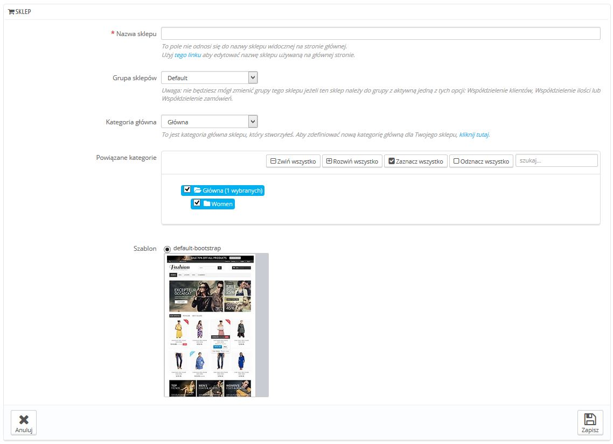
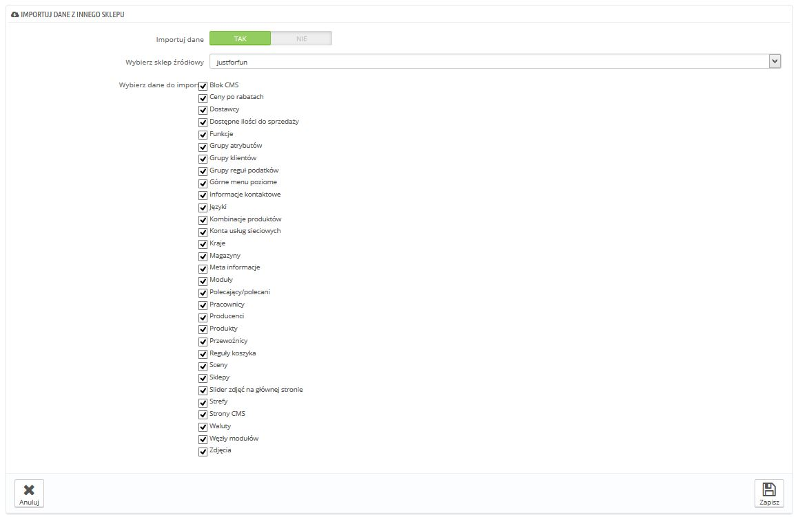

# Tworzenie nowego sklepu

Narzędzie do tworzenia sklepu znajduje się na stronie "Multisklep", pozwala Ci na proste i precyzyjne określenie wyglądu Twojego sklepu (za pomocą szablonu) oraz elementów, które chcesz przenieść z istniejącego sklepu do nowego.

Naciśnij na "Dodaj nowy sklep" a pojawi się formularz podzielony na dwie części. Pierwsza posiada 5 opcji:

* **Nazwa sklepu**. Nazwa jest publiczna: klienci będą ją widzieć w wielu miejscach, jak na przykład w tytule strony, czy e-mailach. Upewnij się, że nazwa dobrze opisuje sklep.
* **Grupa sklepów.** Sklep może należeć tylko do jednej grupy. A także **MUSI** należeć do grupy: nie może istnieć poza grupą sklepów - nawet jeśli tylko jeden sklep należy do danej grupy.\
  &#x20;Uwaga: Nie będziesz mógł przenieść dany sklep do innej grupy, jeśli dana grupa ma włączoną jedną z trzech wymienionych w poprzednim rozdziale opcji.
* **Kategoria główna**.  Podczas gdy twój sklep główny posiada katalog główny w jego głównej kategorii, każdy inny sklep może albo korzystać z tej kategorii głównej, albo używać każdej innej kategorii jako kategorii głównej - w ten sposób powstaje podkatalog dla katalogu głównego.
* **Powiązane kategorie**. Ponadto aby ograniczyć katalog sklepu do podkatalogu katalogu głównego (patrz powyżej), możesz określić, że tylko wybrane podkategorie kategorii głównej będą dostępne w nowym sklepie.
* **Szablon**. Możesz skorzystać z każdego szablonu dostępnego w sklepie. W wyniku czego, możliwe jest posiadanie dokładnie takiego samego katalogu, z zupełnie innym sklepem, innym adresem i cenami.

Kolejna część "Importuj dane z innego sklepu", to miejsce gdzie określisz, które dane z obecnego sklepu mają znaleźć się w nowym

Posiada ona 3 opcje:

* **Importuj dane**.Jeśli wyłączone, to Twój sklep, nie będzie dzielić żadnych informacji z innym sklepem i ta część wyłączy się. Podczas gdy jest to przydatne, gdy chcesz zarządzać dwoma zupełnie różnymi sklepami w ramach jednej instalacji PrestaShopa, to oznacza również, że musisz skonfigurować obydwa sklepy od A do Z, podczas gdy współdzielenie informacji oznacza, że nie będzie trzeba tworzyć przewoźników, walut, czy modułów. Przemyśl dobrze wybór zanim go dokonasz, bo nie będzie mógł jej cofnąć.
* **Wybierz sklep źródłowy**. Jeśli chcesz importować dane, musisz określić z którego istniejącego sklepu  je pobrać. Jeśli masz już zdefiniowany sklep dodatkowy obok głównego, to pozwoli Ci na utworzenie "kopii" tego sklepu, zamiast importować ponownie określony wybór opcji do nowego sklepu.
* **Wybierz dane do importu**. Tutaj możesz określić, jakie dane pobierzesz do nowego sklepu ze sklepu głównego. Powinieneś co najmniej importować wszystkie moduły, nawet jeśli to oznacza wyłączenie niektórych, ponieważ całość Front-Office jest wyświetlany za pomocą modułów, ale także część Back-Office opiera się na modułach.

Jeśli tworzysz produkt w nowym sklepie, który już istnieje w innym sklepie, PrestaShop będzie starał się sugerować istniejący produkt, abyś nie musiał wszystkiego odtwarzać.

&#x20;Podczas zapisywania sklepu, PrestaShop ostrzeże Cię, że nie posiada on jeszcze adresu URL. Naciśnij na czerwone ostrzeżenie, aby go dodać (patrz część "Ustalanie nowego adresu URL sklepu").
