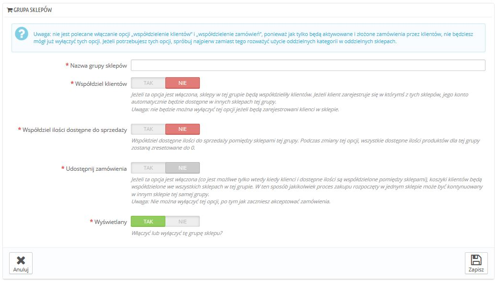

# Tworzenie nowej grupy sklepów

Posiadanie grup sklepów pozwala Ci dzielić pewne charakterystyki pomiędzy sklepami w tej grupie: katalog, pracowników, przewoźników, moduły etc. Pozwala to na zarządzanie zbiorem sklepów tak prosto, jakby to był jeden sklep, podczas gdy możesz każdy sklep "dostroić" ręcznie.

Dodawanie nowych parametrów do wszystkich sklepów wymaga tylko jednej czynności. Gdy jesteś w trybie multistore, rozwijane menu jest dostępne dla większości stron administracyjnych i pozwala Ci na filtrowanie zmian według sklepu/grupy sklepów.

Technicznie rzecz biorąc, gdy zaznaczasz grupę sklepów w menu multisklepu, wyświetlane encje odpowiadają **zbiorowi** encji należących do sklepów tej grupy

Mówiąc ogólnie, parametry są nadawane wszystkim encjom należącym do wybranej encji w menu rozwijanym Multisklepu.

Naciśnij "Dodaj nowa grupę sklepów" a pojawi się formularz, z kilkoma opcjami i sporą ilością tekstu: należy przeczytać każdy opis od początku do końca, ponieważ pomogą podjąć Ci decyzję odnośnie tych opcji. Niektóre z nich są nieodwracalne (nie możesz ich wyłączyć po uruchomieniu), więc to bardzo ważne świadomie je uruchamiać.

Dostępne opcje to:

* **Nazwa grupy sklepów**. Nazwa jest prywatna, klienci jej nie będą widzieć, niemniej jednak wybierz nazwę, która coś oznacza, im więcej grup będziesz miał tym ważniejsze będzie wyszukanie odpowiedniej grupy szybko.
* **Współdziel klientów.** _**Raz włączone nie będzie można wyłączyć.**_ To jest świetna opcja, jeśli chcesz pozwolić klientom na korzystanie z tych samych dostępów we wszystkich, lub grupach sklepów.
* **Współdziel ilości dostępne do sprzedaży**. Możesz mieć różne ilości tego samego produktu do sprzedaży w Twoich sklepach. Z tą opcją, wszystkie sklepy z tej grupy będą dzieliły tę samą dostępną ilość produktów.
* **Udostępnij zamówienia.** _**Raz włączone nie będzie można wyłączyć.**_  Ta opcja może być włączona tylko jeśli opcje "Współdziel klientów" oraz "Współdziel ilości dostępne do sprzedaży**"** są włączone. Z tą opcją zalogowani klienci będą mogli podejrzeć historię zamówień ze wszystkich sklepów w grupie.
* **Wyświetlany**. Możesz określić, czy wyświetlać od razu grupę, czy może później. Możesz włączyć i wyłączyć grupę w każdy momencie.

Dwie grupy sklepów nie mogą dzielić klientów, koszyków i zamówień

Istniejące grupy sklepów mogą być edytowanie na liście grup na stronie "Multisklep", po prostu naciśnij na edytuj przy odpowiedniej grupie, a pojawi się formularz. Jak była mowa powyżej, nie możesz edytować niektórych ustawień.
