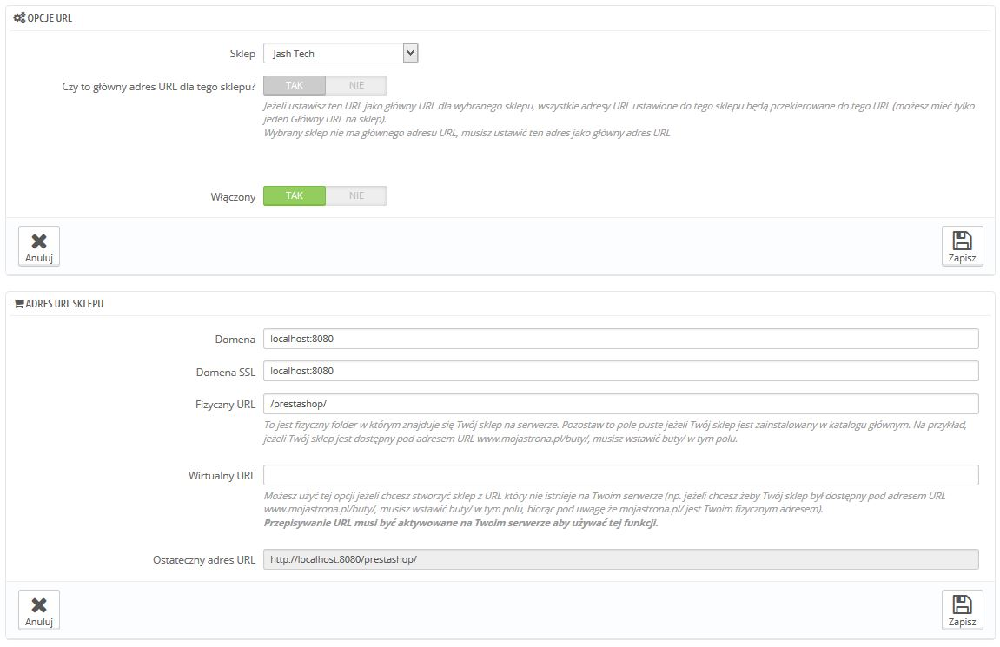

# Ustalanie nowego adresu URL sklepu

Każdy sklep może posiadać własny adres URL - albo nawet klika adresów, całkowicie niezależnych od sklepu głównego (pierwszego, jaki zainstalowałeś).\
Musisz określić co najmniej jeden adres dla każdego sklepu.

**Dwa sklepy nie mogą dzielić tego samego adresu**.  Jeśli spróbujesz przypisać nowy sklep do adresu, z którego korzysta już inny sklep, PrestaShop wyświetli błąd.\
&#x20;Z drugiej strony, w ramach jednej domeny, możesz mieć tyle sklepów ile chcesz:

*   Używając podkatalogów: [http://www.example.com/men/](http://www.example.com/men/), [http://www.example.com/women/](http://www.example.com/women/), [http://www.example.com/kids/](http://www.example.com/kids/), [http://www.example.com/pets/](http://www.example.com/pets/), etc.

    W przypadku sklepów podkatalogowych, utwórz dwa adresu url, jeden rozpoczynający się "www", a drugi bez!

    Na przykład: [http://www.example.com/men/](http://www.example.com/men/) i [http://example.com/men/](http://example.com/men/)

    W przeciwnym razie , klienci, którzy będą  próbować dostać się do Twojego sklepu bez wpisywania "www" będą przekierowywaniu na adres sklepu głównego.
* używając poddomen: [http://men.example.com/](http://men.example.com/), [http://women.example.com/](http://women.example.com/), [http://kids.example.com/](http://kids.example.com/), [http://pets.example.com/](http://pets.example.com/), etc.

Nie twórz poddomen albo podkatalogów samodzielnie, ani na komputerze, ani na serwerze. PrestaShop zajmie się utworzeniem ścieżek za Ciebie na Twoim serwerze. Gdy klient zarząda ścieżki, PrestaShop rozpozna sklep i wskaże automatycznie pliki oraz dane do prawidłowego sklepu.

Oczywiście sklep może posiadać własną domenę.

Using a domain name

Jeśli chcesz korzystać z innej omeny dla dodatkowego sklepu zamiast skorzystać z podkatalogu czy poddomeny, musisz skonfigurować domenę wskazując katalog, gdzie znajduje się PrestaShop. Przepisywanie adresów URL odbywa się w PrestaShopie.

Alternatywnie, możesz utworzyć alias dla swojej domeny, który przekierowuje ruch do adresu absolutnego, gdzie znajduje się Twoja domena. To, jak to zrobisz, zależy od panelu kontroli i opcji, które udostępni Ci Twoja firma hostingowa. Szukaj "Alias" w przypadku Plesk, "Forward" w przypadku CPanel, "Aliasdomain" w przypadku ISPConfig, etc.

Aby dodać adres URL, zaznacz sklep w tabeli Multisklep, naciśnij przycisk "Kliknij tutaj, aby określić URL dla nowego sklepu.PrestaShop załaduje nowy formularz z kilkoma opcjami:

* **Opcje URL**.
  * **Sklep**. Przypomnienie, dla którego sklepu chcesz dodać adres URL. Możesz też zmienić sklep na innym.
  * **Czy to główny adres URL dla tego sklepu**.Jeżeli ustawisz ten URL jako główny URL dla wybranego sklepu, wszystkie adresy URL ustawione do tego sklepu będą przekierowane do tego URL (możesz mieć tylko jeden Główny URL na sklep).
  * **Włączony**. Możesz włączyć lub wyłączyć adres URL, kiedy chcesz.
*   **Adres URL sklepu**.

    * **Domena.** Domena sklepu,, nie musi być ograniczona do nazwy domeny, możesz także wskazać nazwę poddomeny, jeśli potrzeba. Upewnij się tylko, że nie podasz żadnego "http://" ani "/", na przykład: [`www.example.com`](http://www.example.com) albo [`kids.example.com`](http://kids.example.com).
    * **Domena SSL**. Jeśli domena SSL różni się o Twojej domeny głównej, upewnij się, że ją tutaj wprowadziłeś. Na przykład: [`www.example.com`](http://www.example.com) albo [`kids.example.com`](http://kids.example.com).
    * **Fizyczny URL**. To jest fizyczny folder w którym znajduje się Twój sklep na serwerze. Pozostaw to pole puste jeżeli Twój sklep jest zainstalowany w katalogu głównym. Na przykład, jeżeli Twój sklep jest dostępny pod adresem URL [www.mojastrona.pl/buty/](http://www.mojastrona.pl/buty/), musisz wstawić /buty/ w tym polu.
    * **Wirtualny URL**. Możesz sprawić, że sklep będzie transparentnie dostępny dla klientów korzystając z tej opcji:  za pomocą mocy drzemiącej w przepisywaniu adresów URL, możesz wyświetlać Twój sklep bez konieczności tworzenia podkatalogu. Oczywiście funkcja przepisywania, musi być włączona najpierw w PrestaShopie (patrz strona Preferencje->SEO & URL). Na przykład: `/buty/`. Pamiętaj o tym, że działa to wyłącznie dla podkatalogów, ale nie dla subdomen.
    * **Ostateczny adres URL**. Pokazuje Ci, jak powyższe ustawienia określą finalny adres URL sklepu.

    
