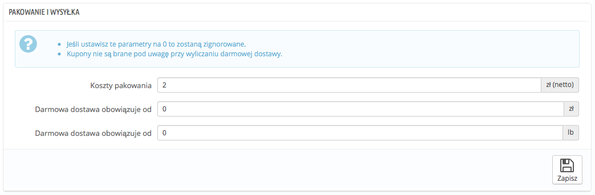
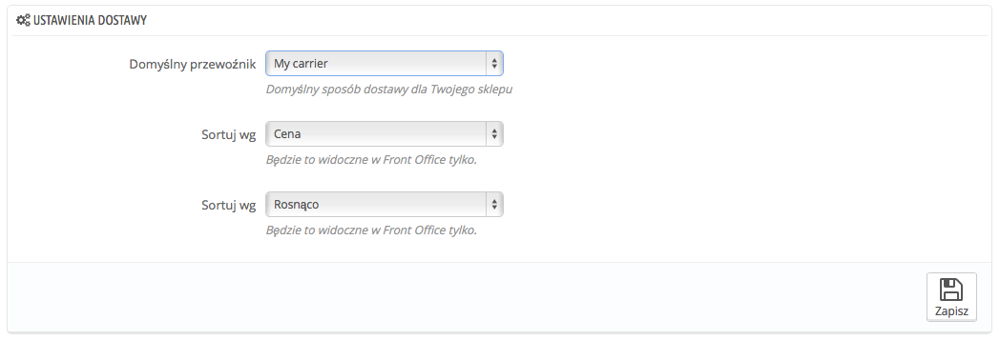

# Ustawienia wysyłki

Ogólne ustawienia wysyłki znajdują się na stronie „Preferencje” w menu „Wysyłka”.

Strona ta pozwala regulować wysokość opłat:

* **Opłata manipulacyjna**. Wpisz koszty manipulacyjne dla każdego zamówienia, które dodane zostaną do ostatecznej ceny zakupu. Są one niezależne od kosztów wysyłki: dotyczą pracy Twojej i Twoich pracowników, obejmują koszty sprowadzenia produktów, zapakowania ich oraz nadania. Jeśli nie ma takich kosztów, wpisz 0.
* **Darmowa dostawa obowiązuje od (waluta)** oraz **Darmowa dostawa obowiązuje od (waga)**. Wpisz kwotę bądź wagę, od której konsumenci otrzymają darmową dostawę. Możesz przykładowo zaoferować darmową wysyłkę, gdy zamówienie przekracza $250. Klientom wyświetli się komunikat informujący, jak dużą kwotę muszą wydać, aby otrzymać bezpłatną dostawę.\
  &#x20;Jeśli nie chcesz tego oferować, ustaw w obu polach wartość 0.

Sekcja „Ustawienia dostawy” oferuje dostęp do 3 ustawień:

* **Domyślny przewoźnik.** Jeśli w ofercie masz kilku przewoźników, możesz chcieć szczególnie polecać jednego z nich swoim klientom. Oprócz przewoźników rozwijana lista zawiera dwie opcje:\

  * **Najlepsza cena.** W zależności od wielkości zamówienia, jego wagi i strefy dostawy PrestaShop wybierze najniższą dla klienta cenę.
  * **Najlepszy czas dostawy.** Zróżnicowany czas dostawy pozwala wyodrębnić najszybszych przewoźników. PrestaShop wyświetli przewoźnika, który, w odniesieniu do danego zamówienia, będzie miał najkrótszy czas dostawy.
* **Sortuj według.** Gdy klientom prezentowani są przewoźnicy do wyboru, można zdecydować o ich posortowaniu albo według ceny wysyłki, albo według ich pozycji na liście.
* **Sortuj (szereguj) według**. Pozwala ustalić kolejność, w jakiej przewoźnicy są uporządkowani:\

  * Jeśli przewoźnicy są uporządkowani według ceny rosnąco, wówczas zostaną wyświetleni od najtańszego do najdroższego.
  * Jeśli przewoźnicy są uporządkowani według pozycji malejąco, wówczas zostaną wyświetleni od najwyższej pozycji na liście do najniższej.
