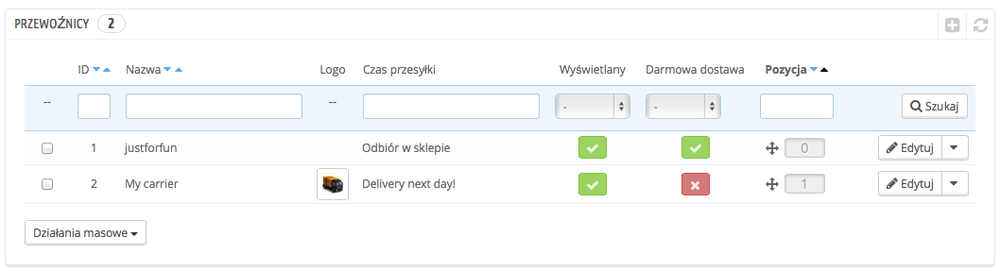
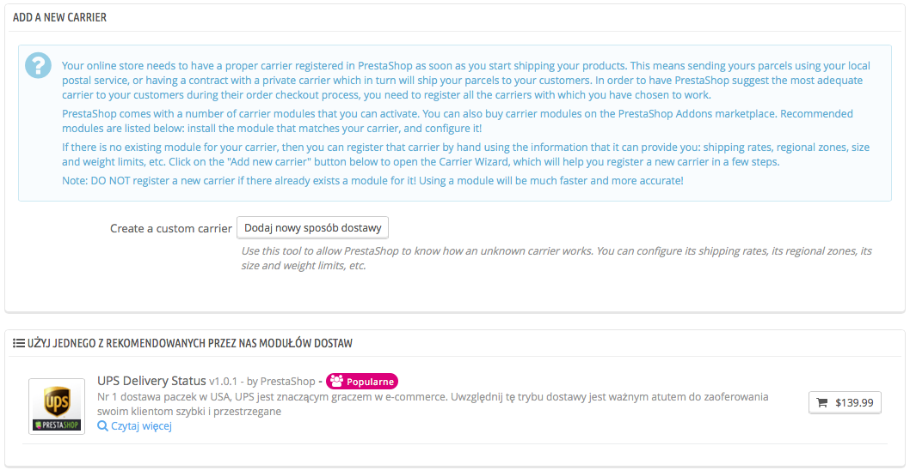
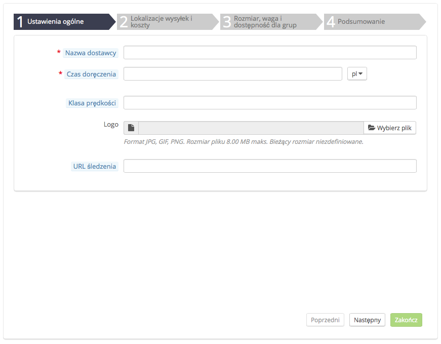
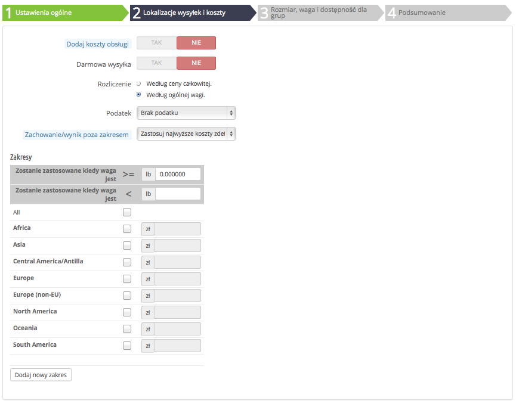
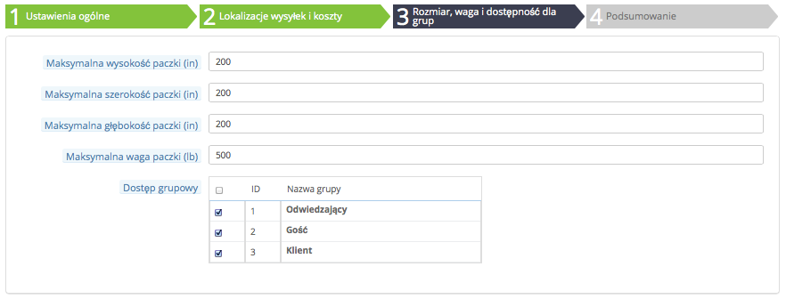
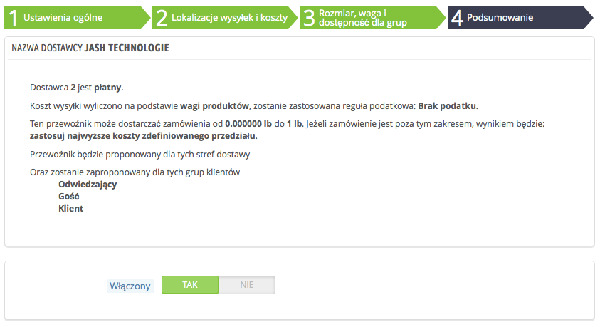

# Zarządzanie przewoźnikami

Musisz zarejestrować przewoźników w swoim PrestaShop – należy wyraźnie wskazać, kto będzie dostarczał Twoje produkty. To możesz być tylko Ty i Twój sklep (jeśli np. sprzedajesz jedynie produkty do pobrania lub działasz wyłącznie lokalnie), lecz jeśli tylko wysyłasz paczki, stosując znaczki i korzystając z usług osób trzecich, jak lokalny urząd pocztowy, FedEx, UPS itd., musisz mieć dodane szczegóły o nich do bazy danych Twojego sklepu. To umożliwi Twoim klientom lepszy wybór przewoźnika, oparty na podstawie ich zakresów dostaw, opłat i terminów.

Strona „Przewoźnicy” zawiera listę wszystkich Twoich dotychczasowych przewoźników. Z tego miejsca możesz bezpośrednio zmieniać ich status, wskazać, czy sposób dostawy jest bezpłatny, czy nie i zmienić ich statusu, gdy wyświetlają się klientom.

Domyślnie masz dwóch przewoźników w Twojej bazie danych:

* Twój własny sklep: Pod tym kryje się Twój fizyczny sklep, do którego klienci mogą przyjść i wybrać samodzielnie produkty. Zakres cenowy i wagowy nie jest tam ustawiony.
* „Mój przewoźnik”: To przykładowy przewoźnik, który nie powinien być wykorzystywany, gdy sklep już funkcjonuje. Posiada jeden zakres cenowy (od $0 do $10000) i jeden wagowy (od 0 kg do 10000 kg).

Do Ciebie należy usunięcie tych domyślnych przewoźników i dodanie nowych dla Twoich klientów. W najgorszym wypadku powinieneś edytować nazwę „Mój przewoźnik” i zastąpić jego dane informacjami o rzeczywistym przewoźniku: nazwą, danymi oraz zakresami. Szczerze zalecamy usunięcie „Mojego przewoźnika” i skorzystanie z dostępnego modułu dostawców w celu zarejestrowania współpracującego z Tobą dostawcy.

Nowych przewoźników dodaje się, klikając na przycisk „Dodaj nowy sposób dostawy”. Otwiera to nową stronę z dwiema opcjami:

* **Użyj jednego z rekomendowanych przez nas modułów dostaw.** Jest wysoce zalecane, aby zarejestrować przewoźników, instalując moduł dostawców: to znacznie przyspieszy proces, a ustawienia będą bardziej precyzyjne.
* **Dodaj nowy sposób dostawy.** Jeśli zarówno wśród wbudowanych modułów, jak i w sklepie PrestaShop Addons nie możesz odnaleźć modułu odpowiadającego dostawcy, z którym współpracujesz, wówczas powinieneś zarejestrować przewoźnika samodzielnie, stosując „Kreator dostawców”. Kliknij przycisk „Dodaj nowy sposób dostawy”, by uruchomić to narzędzie.

Pojawia się nowy ekran, który dodany został w wersji 1.6.0.7 PrestaShop. Pomoże Ci w podjęciu decyzji, czy można zainstalować moduł dostawy, czy też musisz skonfigurować własnego dostawcę, używając Kreatora Dostawców.

## Tworzenie nowego przewoźnika przy użyciu Kreatora Dostawców 

Ta sekcja służy wprowadzeniu nowego dostawcy, od A do Z, przy pomocy Kreatora Dostawców. Możesz utworzyć tu tak wielu przewoźników, ilu potrzebujesz. Jeśli jeden przewodnik oferuje różne usługi transportowe, powinieneś wprowadzić wielu dostawców i nadać im różne nazwy.

Wiele szczegółów wymaganych w formularzu PrestaShop powinno być dostarczonych przez Twoich przewoźników, kiedy utworzyłeś u nich konto lub podpisałeś z nimi umowę. Skontaktuj się z nimi, aby upewnić się, że wszystko zostało poprawnie skonfigurowane.

Aby utworzyć nowego przewoźnika, kliknij przycisk „Dodaj nowy sposób dostawy” w zakładce „Przewoźnicy”. Spowoduje to otwarcie pierwszego widoku Kreatora Dostawców.

### Widok 1: Ustawienia ogólne 

To miejsce, w którym należy opisać przewoźnika, podając informacje, których klient będzie potrzebował w celu rozpoznania i wyboru preferowanego dostawcy.

Przeanalizujmy wszystkie informacje, które należy wprowadzić:

* **Nazwa dostawcy.** Wyświetla się publicznie, więc należy użyć oficjalnej nazwy. Jeśli jeden przewoźnik świadczy wiele usług dostawy, możesz odróżnić je, posługując się odmiennymi nazwami.\
  Możesz dodać także opis usługi, wpisując np. „PrestaShop – 500 kg i więcej”.
* **Czas doręczenia.** Szacowany czas potrzebny na dostarczenie Twoich produktów, napisany jasnym językiem. Ta informacja wyświetlana jest klientom podczas składania zamówienia. Pomoże im wybrać przewoźnika na podstawie czasu oczekiwania na przesyłkę. Klienci często skłonni są zapłacić więcej, by otrzymać przesyłkę szybciej.\
  Należy wypełnić to pole we wszystkich dostępnych językach, szczególnie domyślnym.
* **Klasa prędkości**. Ponieważ pole „Czas dostarczenia” może zawierać dowolny tekst, nie można go stosować do porównywania usług przewoźników. Opcja „Klasa prędkości” pozwoli Tobie nadać przewoźnikowi klasę, od 0 (bardzo wolno) do 9 (bardzo szybko). To narzędzie służy następnie sortowaniu przewoźników pod względem ich klasy prędkości i pozwala klientom na wybór jednego z nich.L
* **Logo.** Posiadanie logo ułatwia klientom przeglądanie różnych przewoźników. PrestaShop zmieni rozmiar obrazu po to, by pasował do formularza. Logo pojawi się w każdym widoku kreatora dostawców, by przypomnieć, który przewoźnik jest właśnie tworzony/edytowany.
* **URL śledzenia.** To pole należy wypełnić URL dostarczanym przez Twojego dostawcę (jeśli taki istnieje). Na przykład poczta francuska (La Poste) oferuje następujący URL: [http://www.colissimo.fr/portail\_colissimo/suivreResultat.do?parcelnumber=@](http://www.colissimo.fr/portail\_colissimo/suivreResultat.do?parcelnumber=@). Gdy klient zakończy zakupy, otrzyma ten URL, ale znak „@” zastąpiony będzie numerem przesyłki nadanym przez przewoźnika, co sprawi, że po kliknięciu linka będzie można zobaczyć, na jakim etapie jest dostawa.

Naciśnij „Następny”, by przejść do drugiego widoku.

### Widok 2: Lokalizacje wysyłek i koszty 

Widok ten zawiera kilka ustawień:

* **Dodaj koszty obsługi.** Umożliwia wyłączenie lub włączenie kosztów wysyłki i obsługi do ceny przewoźnika
* **Darmowa wysyłka.** Jeśli opcja jest włączona, nie można określić ceny wysyłki. Jeśli opcja jest wyłączona, będzie można edytować zakresy i koszty dla poszczególnych państw w poniższym formularzu.
* **Rozliczenie.** Podczas rozliczania klienta PrestaShop może stosować jedną z dwóch możliwości, które musisz określić w zależności od sposobu, w jaki przewoźnik obsługuje rozliczenia (zapoznaj się z jego dokumentacją na ten temat):\

  * **Według ceny całkowitej**. Rozliczenie zależy od całkowitej ceny zamówienia.
  * **Według wagi całkowitej.** Rozliczenie zależy od całkowitej wagi zamówienia.
* **Podatek.** Wskazuje, czy przewoźnik wymaga lokalnego podatku w celu dostarczenia przesyłki, a jeśli tak to jakiego. Podatek musi być już ustawiony w PrestaShop (można to zrobić na stronie „Podatki” w menu „Lokalizacja”).
* **Wyniki poza zakresem.** W przypadku, gdy wybrany przewoźnik nie określił kosztu wysyłki dla wymaganej strefy lub wagi, można wskazać, jak PrestaShop powinien zareagować. Masz dwie możliwości:\

  * **Zastosuj koszty najszerzej zdefiniowanego przedziału.** PrestaShop wybierze najbardziej kosztowny zakres i zastosuje jego warunki.
  * **Wyłącz sposób dostawy.** PrestaShop nie zaproponuje tego dostawcy, ponieważ prawdopodobnie nie jest w stanie dostarczyć tego zamówienia.

Czas na ważny punkt: tworzenie zakresu dostawy. To bardzo ważny krok, ponieważ PrestaShop potrzebuje tych informacji dla zaprezentowania klientowi dostawcy, który dostarczy zamówioną paczkę. W rzeczywistości, zależnie od całkowitej ceny lub wagi zamówienia, niektóre sposoby dostawy nie będą dostępne, podczas gdy inne wyświetlane będą dla określonych wartości. Należy więc wypełnić te zakresy bardzo dokładnie, posługując się dokumentacją otrzymaną od przewoźników.

W tym miejscu Kreator Dostawców ma największy sens. Tutaj można stworzyć zakresy cenowe i wagowe (zależnie od wyboru opcji rozliczenia), jeden po drugim, nakładając Twoje ceny dla każdej ze stref.

Stworzenie każdego zakresu wymaga kilku kroków:

1.  **Ustaw dolne i górne granice tworzonego zakresu.** Zależnie od wybranego sposobu rozliczenia dla górnego limitu zakresu pojawi  się albo informacja „zostanie zastosowane, kiedy cena jest”, albo „zostanie zastosowane, kiedy jest waga”.

    Należy zauważyć, że dolna granica obejmuje wpisaną liczbę (>=), podczas gdy górna granica nie obejmuje wpisanej liczby (<). Oznacza to, że górny limit zakresu może mieć tę samą wartość, co dolna granica kolejnego zakresu, ponieważ nie będą na siebie zachodzić.
2. **Uzupełnij ceny.** Jak tylko górna i dolna granica zostaną wpisane, PrestaShop umożliwi edycję pola „Wszystkie”. To pole specjalne: jakąkolwiek wartość w nim wpiszesz, zostanie skopiowana do pól wszystkich dostępnych sfer geograficznych, bez żadnych czynności z Twojej strony. Następnie możesz edytować wartość dla każdej strefy z osobna.\
   Zaznacz pole wyboru dla każdej strefy, do której przewoźnik dostarcza przesyłkę w danym zakresie. Jeśli przewoźnik nie dostarcza przesyłek w danej strefie geograficznej dla tego konkretnego zasięgu, należy pamiętać o odznaczeniu tego pola.
3. **Stwórz zakres**. Kliknij przycisk „Dodaj nowy zakres”. PrestaShop doda kolejną kolumnę z polami stref. Zacznij ponownie od ustalania dolnej i górnej granicy zakresu, a potem uzupełniania cen dla stref geograficznych.

Jednostki masy i ceny są domyślne dla PrestaShop. Możesz zmienić je na stronie „Lokalizacja” w menu „Lokalizacja”.

Kliknij przycisk „Następny”, by przejść do trzeciego widoku.

### Widok 3: Rozmiar, waga i dostępność dla grup 

Ten widok zawiera dwa zbiory opcji:

* **Maksymalna wysokość/szerokość/głębokość/waga paczki.** W tym miejscu można wskazać minimalną i maksymalną wysokość i szerokość paczki, które są kluczowym elementem przy wyborze dostawcy. Zaletą jest użycie takich jednostek miar i wag, jak te określone w menu „Lokalizacja” na stronie „Lokalizacja”.
* **Dostęp grupowy**. Możesz chcieć, aby tylko pewne grupy użytkowników mogły korzystać z dostawcy. Temu służy ta opcja.

Kliknij przycisk „Następny”, by przejść do czwartego, ostatniego, widoku.

### Widok 4: Podsumowanie 

Ostatni widok umożliwia przegląd Twoich ustawień dla danego przewoźnika.

Jeśli któreś z nich są niewłaściwe, możesz wrócić do dowolnego z poprzednich widoków albo używając przycisku „Poprzedni”, albo bezpośrednio klikając w zakładkę panelu.

Jeśli chcesz zapisać tego przewoźnika na razie w formie szkicu, a wrócić do niego w późniejszym czasie, wyłącz przewoźnika, klikając w przycisk „Nie”, znajdujący się przy opcji „Włączony”, u dołu tego widoku. W każdym przypadku kliknij przycisk „Zakończ”, by zachować swoją pracę i stworzyć przewoźnika.

Używając PrestaShop w trybie multisklepu, dostępny jest inny widok, a kolejność widoków trochę się zmienia:

1. Ustawienia ogólne
2. **Multisklep**
3. Miejsca i koszty wysyłki
4. Rozmiar, waga, dostępność dla grup
5. Podsumowanie

Wszystkie panele funkcjonują tak, jak opisano powyżej. Nowy, „Multisklep”, umożliwia ograniczenie danego przewoźnika, dla wybranych sklepów.

## Dodawanie przewoźnika za pomocą modułu dostaw 

PrestaShop wyposażony został w szereg bezpłatnych modułów, pośród których można znaleźć kilka modułów dostawców, które możesz zainstalować od razu dla największych przewoźników międzynarodowych i krajowych.

Dostępni przewoźnicy zależą od początkowych ustawień Twojego sklepu: jeśli ustawiłeś lokalizację swojego sklepu we Francji, nie otrzymasz tych modułów, które byłyby dla Ciebie dostępne, gdybyś lokalizację sklepu ustawił na USA.

Na ekranie z przyciskiem „Dodaj nowego przewoźnika” można wybrać pomiędzy stworzeniem przewoźnika przy pomocy Kreatora Dostawców lub przy pomocy jednego z polecanych modułów dostaw. Zaleca się, by rejestrować przewoźników, instalując moduł dostaw: to znacznie przyspieszy cały proces, a ustawienia będą bardziej precyzyjne.

W zależności od modułu możesz albo kliknąć przycisk „Instaluj” i pozwolić PrestaShop wykonać pracę, albo kliknąć na przycisk koszyka. W tym drugim przypadku zostaniesz przeniesiony do sklepu Addons, w którym możesz kupić moduł. Po zakupieniu modułu można go zainstalować i skonfigurować.
