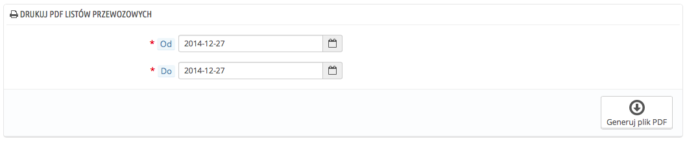

# Druki wysyłki

Powinny być umieszczone na przesyłce zawierającej zamówione produkty. Będą posiadać logo Twojego sklepu oraz wskazywać zawartość. Dzięki temu podczas odbioru przesyłki klient będzie dzięki zweryfikować, czy zawartość pokrywa się z tą opisaną w liście przewozowym.

Pobieranie druków listów przewozowych odbywa się dokładnie tak, jak to się dzieje w przypadku faktur. Wybierz daty oraz opcje i zapisz, aby stworzyć dokumenty.

Możesz wygenerować plik PDF zawierający wiele listów przewozowych, co jest przydatne, jeśli chcesz wydrukować listy z danego dnia lub kwartału. Określ datę początkową i końcową, a następnie naciśnij "Generuj plik PDF".

## Opcje listu przewozowego 

Opcje dla listu przewozowego są takie same, jak w przypadku faktur:

* **Prefiks dostawy.** Domyślnie PrestaShop stosuje prefiks oparty na języku: "DE" (od "delivery") dla języka angielskiego, "LI" (od "livraison") dla francuskiego etc. Zamiast tego możesz korzystać z sygli "EN" czy "FR".  Możesz oczywiście określić dla każdego języka sklepu inny prefiks albo nie musisz go podawać w ogóle.
* **Numer dostawy.** Jeśli prowadzisz działalność już od jakiegoś czasu i masz zamówienia dokonane jeszcze przed zbudowaniem sklepu na PrestaShop, możesz wykorzystać tę opcję, aby rozpocząć numerowanie listów przewozowych od wyższej wartości.

PrestaShop wygeneruje listy przewozowe według ustawień: #DE0000001, #LI000002 etc.

Nie zapomnij zachować ustawień.
