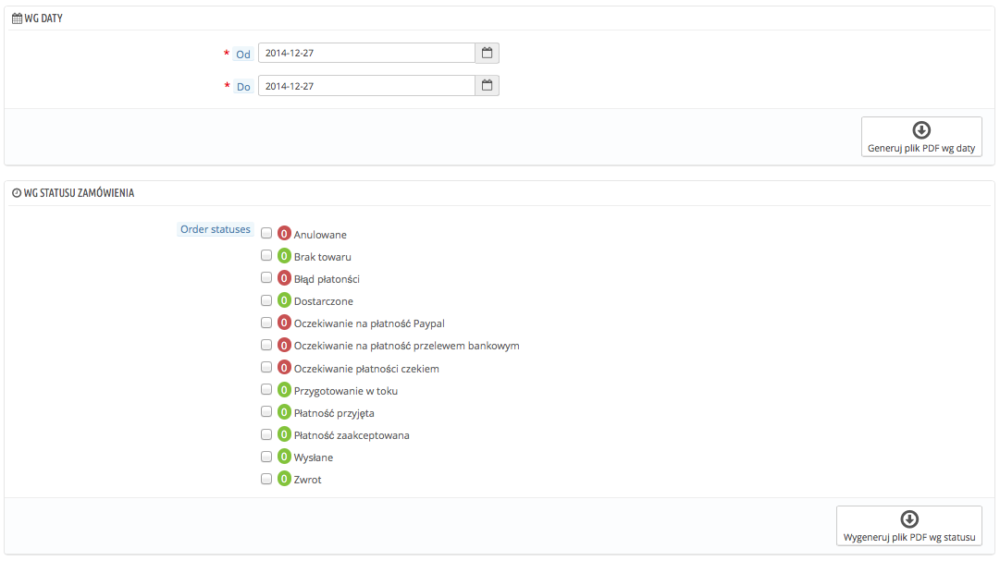
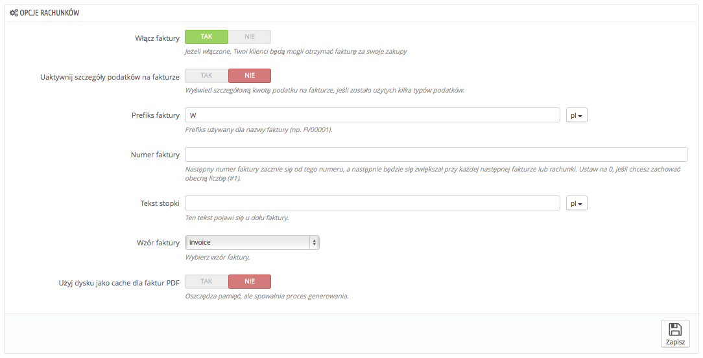

# Faktury

Każdorazowo po potwierdzeniu zamówienia w Twoim sklepie, wysłana zostaje do klienta faktura. Możesz pobrać faktury dla pojedynczego zamówienia na stronie zamówienia. Strona "Faktury" w menu "Zamówienia" pozwala Ci na pobranie wybranych faktur jednocześnie (w tym samym pliku PDF).

Możesz otrzymać plik PDF zawierający wiele faktur na podstawie dwóch kryteriów:

* **Według daty.** Bardzo przydatna funkcja, kiedy chcesz wydrukować faktury za konkretny miesiąc czy kwartał. Zaznacz datę początkową i końcową, a następnie naciśnij "Generuj plik PDF według daty".
* **Według statusu zamówienia**. Opcja przydatna wtedy, gdy chcesz wydrukować np. zamówienia anulowane, zwroty etc. PrestaShop pokazuje liczbę faktur powiązanych ze statusem zamówienia.

W każdym z tych przypadków faktury generowane są do pojedynczego pliku .PDF, po jednej fakturze na stronę. Ta strona nie pozwala Ci na pobranie odrębnych plików .PDF dla każdej z faktur, wystawionej w podanym okresie bądź dotyczącej określonego statusu zamówienia.Możesz łatwo spersonalizować wygląd faktury. szablon PDF znajduje się w katalogu `/pdf`. Pliki `.tpl` to tak naprawdę pliki HTML z kodem Smarty dla danych dynamicznych. Możesz zmienić wygląd faktury, edytując plik "`invoice.tpl`".

## Opcje faktur 

Możesz określić, czy faktury powinny być dostępne od razu po złożeniu zamówienia, a także zdefiniować prefiks faktury oraz numer, który chcesz wyświetlać na jej wersji drukowanej. Ta funkcja jest pomocna w zarządzaniu kontem.

* **Włącz faktury.** Kiedy wyłączone, Twój klient nie otrzyma faktury po dokonaniu zakupu. Będziesz odpowiedzialny za dostarczenie faktury, jeśli klient o nią poprosi.
* **Uaktywnij szczegóły podatków na fakturze.** Nowość w wersji 1.6. Kiedy włączone, faktura wyszczególnia wszystkie podatki, które zostały nałożone w zamówieniu, zamiast przedstawiać je jedynie w formie jednej wartości procentowej.
* **Prefiks faktury**. Domyślnie PrestaShop stosuje prefiks oparty na kodach językowych: "IN" dla faktur angielskich, "FA" francuskich etc. Zamiast tego możesz korzystać z sygli "EN" czy "FR".  Możesz oczywiście określić dla każdego języka sklepu inny prefiks albo nie podawać go wcale.\
  PrestaShop wygeneruje numery faktur według Twoich ustawień: "#IN000001", "#FA000002", etc.
* **Numer faktury.** Jeśli prowadzisz już swoją działalność i miałeś już zamówienia i faktury wystawione przed sklepem na PrestaShop, możesz wykorzystać tę opcję, aby rozpocząć numerowanie faktur od wyższej wartości.
* **Tekst stopki.** Być może masz też spersonalizowany tekst w stopce faktury. Tekst będzie widoczny poniżej nazwy Twojego sklepu.
* **Wzór faktury.** W zależności od szablonu możesz używać więcej niż jednego stylu faktur. Przetestuj je na testowym zamówieniu, aby wybrać ten, które bardziej Ci odpowiada. Jeśli znasz kod HTML, możesz utworzyć samodzielnie modele faktur i edytować już istniejące: znajdują się one w katalogu `/pdf` instalacji PrestaShop.
* **Użyj dysku jako cache dla faktur PDF.** Możesz wybrać dysk serwera zamiast jego pamięci podręcznej jako miejsce do generowania faktur. I chociaż zmniejsza to zużycie pamięci serwera, to spowalnia sam proces generowania PDF, więc korzystaj z tego świadomie.

Nie zapomnij zachować zmian.

Jeśli klient pyta Cię o faktury, możesz przekierować go do części " Historia zamówień" jego konta, gdzie wszystkie przeznaczone dla niego dokumenty są przechowywane.
