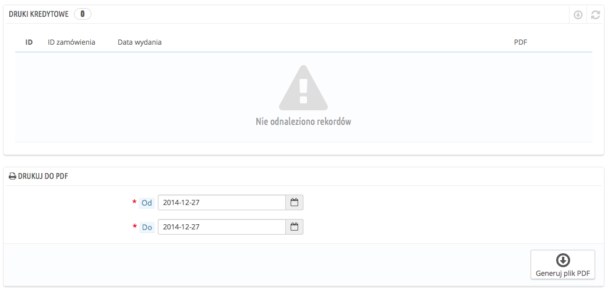
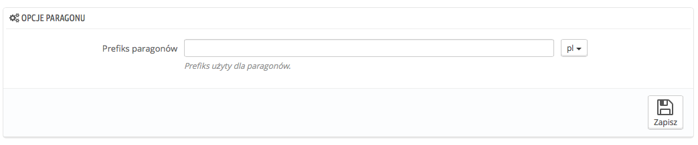
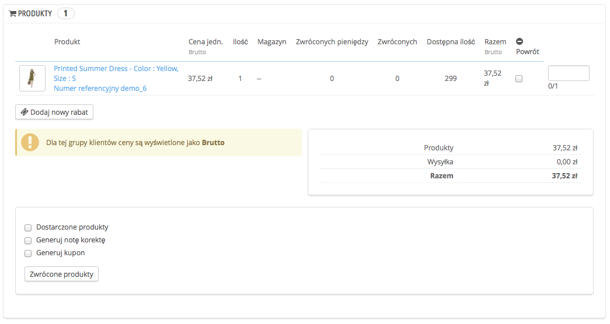

# Potwierdzenia zwrotów

W następstwie zgody na zwrot produktu zapewne otrzymasz przesyłkę od klienta. Wówczas na stronie zamówienia musisz wystawić potwierdzenie zwrotu.

Potwierdzenia zwrotów nie są tworzone w zakładce menu o tej samej nazwie (ang. credit slips), a jedynie tam wyświetlane. Ta strona pozwala również na wygenerowanie potwierdzeń w pliku PDF.

## Opcje paragonu (potwierdzenia zwrotu) 

System w tym miejscu udostępnia tylko jedną opcję:

* **Prefiks paragonów.** Możesz użyć prefiksu, który będzie odmienny dla każdego języka albo zdecydować o nieużywaniu go wcale.

PrestaShop wygeneruje potwierdzenia zwrotów według wskazanych ustawień.

Nie zapomnij ich zapisać.

## Tworzenie potwierdzenia zwrotu 

Na liście zamówień (strona "Zamówienia" w menu) naciśnij na konkretne zamówienie, którego dotyczy zwrot produktu - zadziała to wyłącznie w sytuacji, gdy wskażesz klientowi, że może odesłać produkt.

Na stronie zamówienia, w tabeli "Produkty" zrób, co następuje:

1. Zaznacz produkty zwrócone.
2. Zaznacz pole "Dostarczone produkty", jeśli chcesz, aby produkty ponownie stały się dostępne.
3. Zaznacz pole "Wygeneruj potwierdzenie zwrotu".
4. Jeśli chcesz wynagrodzić klientowi pomyłkę dokonaną w jego zamówieniu, możesz rozważyć przyznanie mu kuponu, zaznaczając przycisk "Generuj kupon".
5. Możesz również zwrócić mu poniesione koszty wysyłki, naciskając "Zwrot kosztów wysyłki".

Po wybraniu wszystkich produktów i opcji, naciśnij przycisk "Zwrócone produkty".

Potwierdzenie zwrotu zostanie wygenerowane i będzie dostępne w szczegółach zamówienia, jak i na stronie "Potwierdzenia zwrotów" (ang. Credit slips).

Tam możesz je pobrać w pliku PDF.

Klient będzie widział potwierdzenie po zalogowaniu na swoje konto.

Jeśli stworzyłeś kupon rabatowy, on również pojawi się na koncie klienta.

Ilość zwróconych produktów zostanie dodana do kuponu. Klient może z niego skorzystać podczas składania kolejnego zamówienia.
