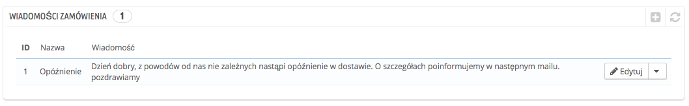
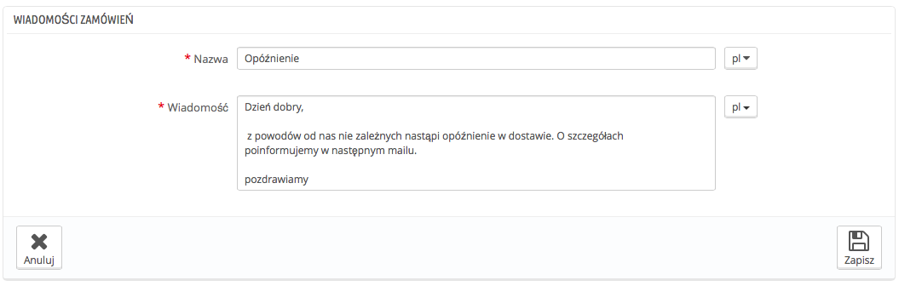
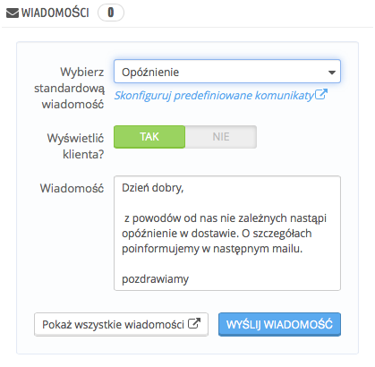

# Powiadomienia o zamówieniu

Kiedy wysyłasz wiadomość do klienta, korzystając z PrestaShop (ze strony zamówienia), możesz ją zapisać, aby móc ją wysłać ponownie do innego klienta, którego dotyczą podobne problemy, komentarze etc.

Aby to zrobić, przejdź na stronę "Treść powiadomień o zamówieniu" w menu "Zamówienia". Jedna domyślna wiadomość o nazwie "Opóźnienie" (ang. Delay) została już zachowana.

## Tworzenie nowej wiadomości 

Aby dodać nową wiadomość, naciśnij "Dodaj nową wiadomość zamówienia". Możesz również edytować wiadomość domyślną.

Formularz sprowadza się do podstawowych informacji:

* **Nazwa.** Nadaj swojej wiadomości opisową nazwę, aby łatwo ją później odszukać.
* **Wiadomość.** Napisz treść wiadomości, którą chcesz wysłać klientowi.

Gdy skończysz, naciśnij "Zapisz"

Możesz utworzyć tyle wiadomości, ile potrzeba.

## Wysyłanie wiadomości do klienta 

Gdy już stworzysz predefiniowane wiadomości, możesz je wysłać bezpośrednio ze strony zamówienia klienta:

1. Zaznacz predefiniowaną wiadomość.
2. Zmień ją, jeśli potrzeba, aby dostosować ją do danego zamówienia.
3. Zaznacz opcję "Wyświetlić klienta?".
4. Naciśnij "Wyślij wiadomość".

Twój klient otrzyma wiadomość na adres e-mail przypisany do konta. Aby śledzić przebieg konwersacji, idź na stronę "Obsługa klienta" w menu "Klienci".
