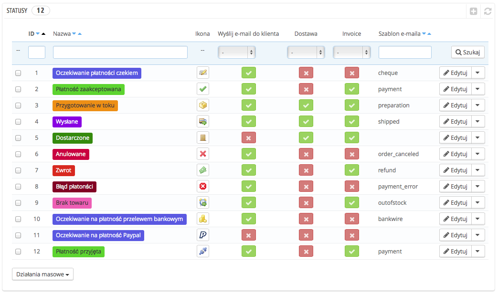
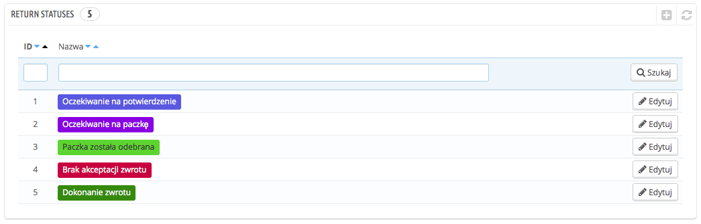
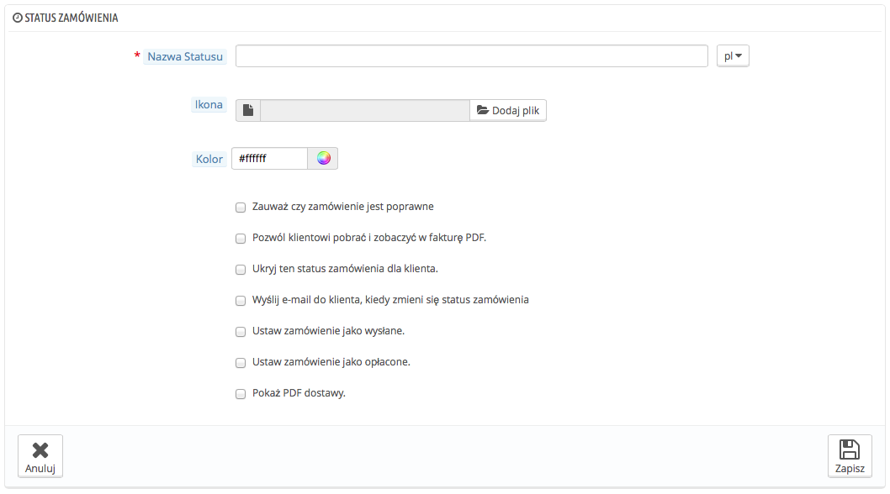
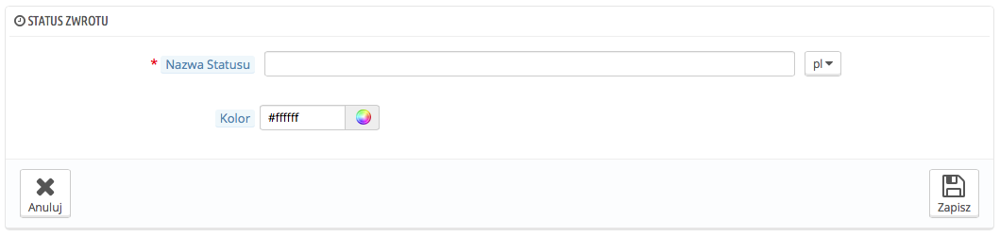

# Statusy

Nadawanie różnych statusów zamówieniom oraz zwrotom nie tylko umożliwia proste zarządzanie zamówieniami i zwrotami, ale również pozwala informować klientów o statusie ich zamówienia.

Różne statusy są widoczne i edytowalne na stronie "Statusy" w menu "Zamówienia".

Strona wyświetla aktualnie zapisane statusy zamówień wraz z:

* Ich kolorami: istniejące statusy są oznaczone kolorami, które pozwalają szybko rozpoznać stan realizacji zamówienia.
* Ich ikonami.
* Ich powiązaniami z trzema zachowaniami PrestaShopa:
  * Czy klient powinien otrzymać e-mail, kiedy zamówieniu nadany zostanie określony status?
  * Czy ten status odnosi się do dostawy?
  * Czy ten status pozwala klientowi pobrać i podejrzeć wersję PDF faktury zamówienia?
* Nazwą szablonu e-maila: możesz edytować te szablony, język po języku, na stronie "Tłumaczenia" menu "Lokalizacja", w części modyfikacji tłumaczeń. Wybierz z listy rozwijanej sekcję "Tłumaczenie wiadomości e-mail", następnie szablon, z którego korzystasz i wreszcie oraz określ język, w którym chcesz wprowadzić tłumaczenie. Potem kliknij na przycisk "Modyfikuj".
* Ich ikony akcji: "edycja" i "usuń"

Lista statusów zwrotów zawiera mniej informacji, ponieważ te statusy są tylko etykietami i nie mają wpływu na zamówienie.

## Tworzenie nowego statusu zamówienia 

Możesz utworzyć nowy status, naciskając przycisk "Dodaj nowy status zamówienia" u góry strony. Ta czynność wywoła poniższy formularz kreacji.

Wypełnij formularz:

* **Nazwa statusu.** Najlepiej, gdy będzie zwięzła oraz charakterystyczna.
* **Ikona.** Możesz użyć jakiejkolwiek ikony 16\*16 pikseli: na przykład tych dostępnych na: [http://www.famfamfam.com/lab/icons/silk/](http://www.famfamfam.com/lab/icons/silk/).
* **Kolor.** Powinno się korzystać z kolorów współgrających z obecnymi statusami: Domyślne użycie kolorów jest następujące:\

  * Czerwony/pomarańczowy: anulowane albo zwrócone zamówienie
  * Ciemnoczerwony: błąd płatności
  * Niebieski: zamówienie oczekujące na płatność
  * Jasnozielony: zamówienie opłacone
  * Ciemnozielony: dostarczone zamówienie
  * Fioletowy: wysłane zamówienie
  * Różowy: zwrócone zamówienie
* Opcje:
  * **Zauważ czy zamówienie jest poprawne.** Gdy opcja ta jest włączona, wszystkie powiązane zamówienia zostają oznaczone jako opłacone, a system nadaje im ten sam status.
  * **Pozwól klientowi pobrać i zobaczyć fakturę w PDF**. Jeśli wyłączona, wówczas Twoim obowiązkiem będzie wysyłanie faktur samodzielnie.
  * **Ukryj ten status zamówienia dla klienta.** To pozwala na tworzenie wewnętrznych statusów, które służą wyłącznie Tobie i Twoim pracownikom. Klienci nigdy nie będą mieć do nich dostępu.
  * **Wyślij e-mail do klienta, kiedy zmieni się status zamówienia**. Kiedy włączona, pojawia się menu rozwijane z szablonem wiadomości do wyboru.
  * **Ustaw zamówienie jako wysłane.** Uważaj, gdy status zamówienia jest oznaczony jako wysłane, ponieważ wówczas nie będzie można przywrócić poprzedniego statusu.
  * **Ustaw zamówienie jako opłacone.** To samo w tym przypadku: status "opłacone" nie pozwala Ci wrócić do poprzedniego statusu zamówienia.
  * **Pokaż PDF dostawy.** Pokazuje plik PDF dostawy.

## Tworzenie nowego statusu zwrotu zamówienia 

Możesz stworzyć nowy status zwrotu, naciskając przycisk "Dodaj nowy status zwrotu zamówienia". Wówczas pojawi się formularz:

Zawiera on tylko dwie opcje:

* **Nazwa statusu.** Podaj odpowiednią nazwę.
* **Kolor.** Określ kolor statusu.

Na końcu zachowaj ustawienia.
