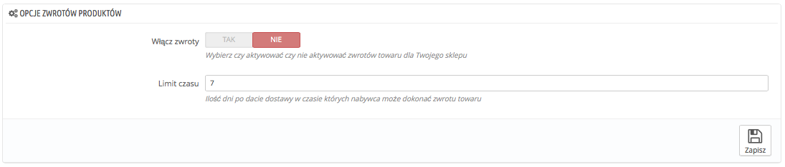
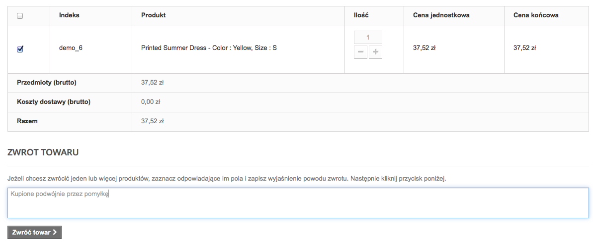
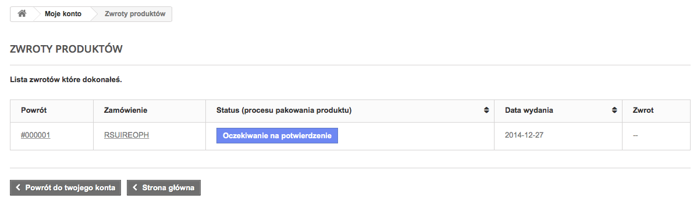
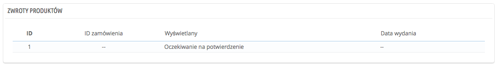
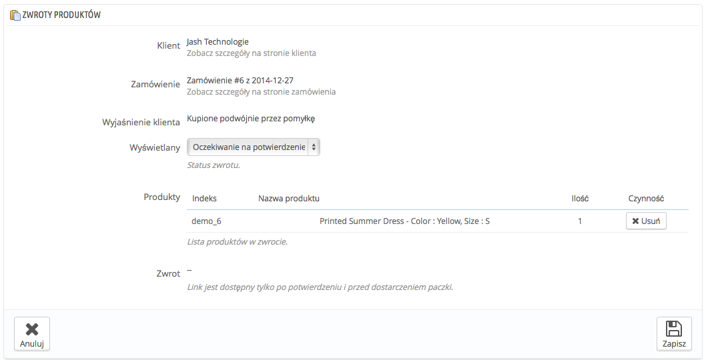
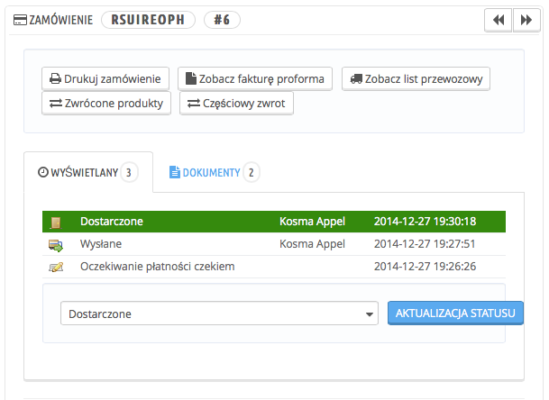

# Zwroty produktów

Strona "Zwroty produktów" przedstawia Ci listę wszystkich trwających procesów RMA (Return merchandise authorization).

U dołu strony możesz włączyć opcję zwrotu produktu. Wybierz i określ ilość dni, podczas których produkt może zostać zwrócony, a następnie zachowaj ustawienia. Od tej chwili Twoi klienci będą mieli możliwość zwrotu towarów.

## Proces zwrotu od strony klienta: 

Po aktywacji opcji zwrotów w sklepie, klient może dokonać zwrotu produktu (jeśli okres zwrotu nadal obowiązuje). Aby to zrobić, musi wykonać następujące czynności:

1. Wejść w zakładkę "Historia zamówień" na swoim koncie klienta.
2. Zaznaczyć zamówienie, którego dotyczy zwrot.
3. Zaznaczyć produkt(y), który chce zwrócić, oznaczając pole przy jego(ich) nazwie.
4. (Opcjonalnie) Wyjaśnić powód zwrotu, aby obsługa sklepu mogła lepiej zrozumieć, dlaczego klient chce to zrobić.

Gdy formularz jest kompletny, klient naciska "Zwróć towar", a odpowiednia informacja zostaje wysłana do obsługi sklepu. Pojawia się ona jako "Oczekiwanie na potwierdzenie" w zakładce "Zwroty produktów" na koncie klienta.

## Zwrot produktu: jak Ty to widzisz 

Informacja o zwrocie pojawi się w panelu administracyjnym. Na początku RMA posiada status "Oczekujące na potwierdzenie".

Proces zwrotu odbywa się w kilku etapach wskazanych statusem RMA:

* Oczekiwanie na potwierdzenie.
* Oczekiwanie na przesyłkę
* Przesyłka została odebrana
* Brak akceptacji zwrotu
* Dokonanie zwrotu

Przyjęcie bądź odrzucenie zwrotu leży w Twojej gestii.

1. Naciśnij na nazwę informacji o zwrocie, aby zobaczyć więcej szczegółów.
2. Zmień status, aby kontynuować proces zwrotu albo go zatrzymać.\

   * Jeśli chcesz go zatrzymać (i odmówić zwrotu pieniędzy klientowi), wybierz status "Brak akceptacji zwrotu".
   * Jeśli przyjmujesz zwrot i chcesz oddać klientowi pieniądze, postępuj w następujący sposób:
     1. Wybierz następny krok w procesie: "Oczekiwanie na przesyłkę", a w ten sposób do klienta zostanie wysłana mailem informacja, że może odesłać produkt.
     2. Po otrzymaniu przesyłki, zmień status zwrotu na "Przesyłka została odebrana".
     3. Na ostatnim etapie, a więc po zakończeniu procesu (po zwrocie pieniędzy klientowi albo przyznaniu mu potwierdzenia zwrotu), zmień status na "Dokonanie zwrotu".
3. Zatwierdź.

## Zwrot kosztów klientowi 

Zamówienie może być refundowane albo częściowo, albo całkowicie. Dokonuje się tego za pomocą dwóch przycisków umieszczonych u góry strony zamówienia, a nie na stronie zwrotów.

Przyciski akcji zmieniają się w zależności od aktualnego statusu zamówienia. Przykładowo, gdy produkt ma status "Dostarczony", pojawiają się dwa przyciski "Zwrócone produkty" oraz "Częściowy zwrot".

Zwrot produktu nie jest funkcją domyślnie włączoną. Aby ją aktywować, idź na na stronę "Zwroty produktów" w menu "Zamówienia" i aktywuj tę opcję sekcji poniżej. W ten sposób będzie ona obowiązywać dla wszystkich zamówień.

* **Zwrócone produkty.** Używaj tej funkcji tylko wtedy, kiedy klient zwrócił produkty: gdy je otrzymasz, możesz je oznaczyć w ten sposób na karcie zamówienia. Po naciśnięciu przycisku "Zwrócone produkty" pojawi się nowa kolumna na karcie zamówienia, przy liście produktów, nazwana "Powrót". Zaznacz pola przy zwróconych produktach, określ ich ilość i naciśnij przycisk "Zwrócone produkty" u dołu tabeli.
* **Częściowy zwrot.** Użyj go wtedy, gdy tylko część zamówienia ma podlegać zwrotowi bądź dlatego że klient zwrócił produkt, bądź jako znak dobrej woli za uszkodzony produkt, który klient zdecydował się mimo wszystko zatrzymać. Naciśnij przycisk "Częściowy zwrot", a niżej, przy liście z produktami pojawi się kolumna "Częściowy zwrot". Określ ilość oraz kwotę dla każdego z produktów, wybierz którąś z opcji poniżej i naciśnij na "Częściowy zwrot".

Gdy określisz produkt jako zwrócony bądź do refundacji, pojawią się 4 opcje do wyboru:

* **Dostarczone produkty.** Gdy zaznaczona, PrestaShop uzna, że produkty zwrócone są znów dostępne do sprzedaży i dlatego podniesie stan magazynowy produktu. Nie powinieneś tego zaznaczać, jeśli zwrot nastąpił ze względu na fakt, że produkt był uszkodzony.
* **Generuj potwierdzenie zwrotu**. Gdy zaznaczona, zostanie wygenerowane potwierdzenie zwrotu, które stanowi zapewnienie ze strony sklepu, że produkt został zwrócony, zaś sklep zwróci pieniądze. Klient będzie mógł z tego skorzystać podczas kolejnego zakupu.
* **Generuj kupon.** Gdy zaznaczona, zostanie wygenerowany kupon na kwotę zwróconych produktów. Kupon przyjmuje formę kodu rabatowego, z którego klient może skorzystać podczas procesu zamówienia. Możesz edytować istniejące kupony klienta, odwiedzając jego stronę:\
  na stronie zamówienia naciśnij na odnośnik pod nazwiskiem klienta w sekcji "Klient", na stronie klienta przejdź do sekcji "Kupony", możesz edytować każdy z nich za pomocą przycisku "Edytuj".
* **Zwrot kosztów wysyłki.** W ramach miłego gestu możesz zwrócić koszty przesyłki poniesione przez klienta w procesie zwrotu.

Jeśli klient zapłacił za towar, posługując się kartą kredytową, system płatniczy powinien dokonać zwrotu automatycznie. Jeśli zamówienie zostało zrobione przelewem albo czekiem, musisz samodzielnie dokonać zwrotu, a następnie zaznaczyć w zamówieniu, że zwrot został dokonany ręcznie.
